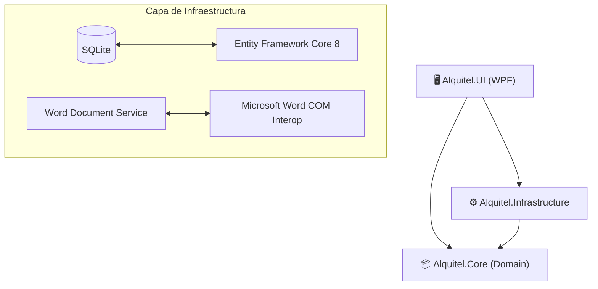
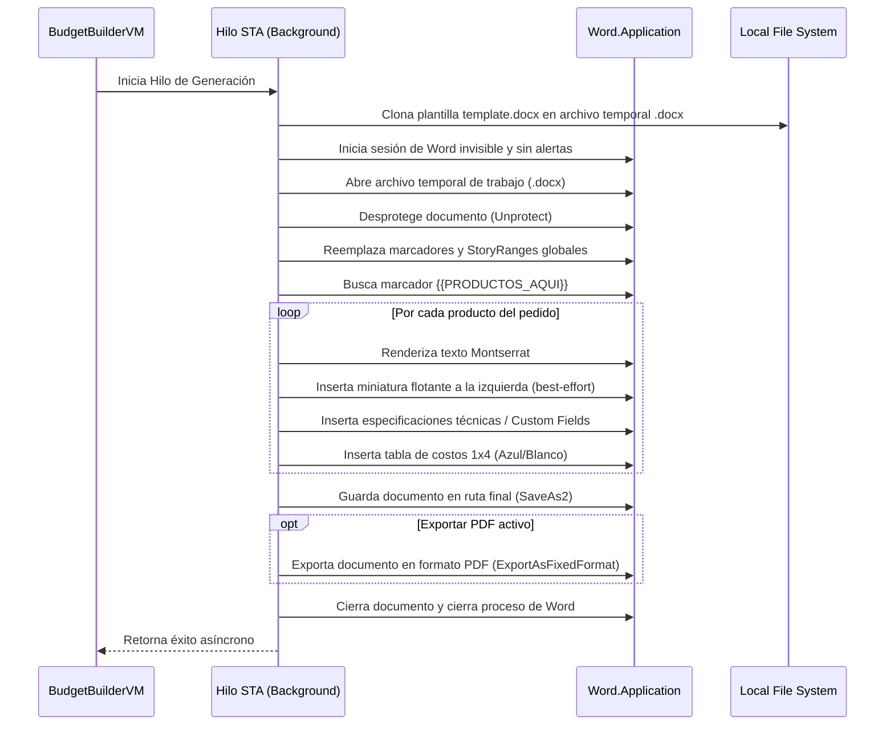

# 🏢 Alquitel - Guía Técnica y Arquitectura del Sistema (CLAUDE.md)

Este archivo sirve como referencia completa y mapa de navegación para la IA (**Claude Code** u otras herramientas de desarrollo), describiendo detalladamente la arquitectura, las entidades, el flujo de datos y el funcionamiento interno del software de gestión corporativa y documental de **Alquitel**.

---

## 🏗️ 1. Resumen del Proyecto y Arquitectura

**Alquitel** es un sistema de escritorio para Windows desarrollado con **.NET 8.0**, **WPF (XAML)**, **Entity Framework Core** con doble proveedor de base de datos (**SQLite** local o **Supabase/PostgreSQL** compartida, según `Database:Provider` en `appsettings.json`) y automatización de **Microsoft Word via COM Interop** (con motor alternativo **OpenXML** experimental sin Word). Su función principal es gestionar catálogos de equipamiento técnico (visuales, sonido, computación) y automatizar en segundos la creación de presupuestos comerciales y órdenes técnicas de trabajo (OT) a partir de descripciones naturales o estructuradas.

Aplica los principios de **Clean Architecture** estructurado en 3 proyectos principales más uno de tests, vinculados en la solución [Alquitel.sln](file:///c:/Proyects/alqui/Alquitel/Alquitel.sln). Existe además un cuarto proyecto **fuera de la solución**: [Alquitel.Mobile](file:///c:/Proyects/alqui/Alquitel/Alquitel.Mobile/README.md) (app Android .NET MAUI, branch `mobile`) que referencia solo `Alquitel.Core` y comparte la base de Supabase — todas las funcionalidades que no dependen de archivos locales (sin Word/OneDrive). No está en el .sln a propósito: el CI compila la solución sin el workload de MAUI; compilalo por csproj (ver su README).

1. **[Alquitel.Core](file:///c:/Proyects/alqui/Alquitel/Alquitel.Core/Alquitel.Core.csproj) (Capa de Dominio/Lógica Pura)**:
   - Contiene las entidades base del negocio.
   - Define las interfaces del sistema (contratos para servicios de infraestructura).
   - Posee algoritmos libres de dependencias de framework (ej: parsing de tags de descripción).
2. **[Alquitel.Infrastructure](file:///c:/Proyects/alqui/Alquitel/Alquitel.Infrastructure/Alquitel.Infrastructure.csproj) (Capa de Datos y Servicios Externos)**:
   - Implementa la persistencia de datos (DbContext de Entity Framework).
   - Implementa los servicios del sistema, incluyendo la automatización de MS Word (Interop COM), el servicio de actualizaciones automáticas (Velopack), el creador de backups automáticos y la persistencia de settings locales.
3. **[Alquitel.UI](file:///c:/Proyects/alqui/Alquitel/Alquitel.UI/Alquitel.UI.csproj) (Capa de Presentación - WPF)**:
   - Implementa el patrón **MVVM** mediante `CommunityToolkit.Mvvm`.
   - Contiene las vistas (XAML), conversores, temas de interfaz (Claro/Oscuro) y los ViewModels controladores.
4. **Alquitel.Core.Tests (xUnit)**: pruebas unitarias de la lógica pura de Core (`CuitValidator`, `TagParser`, `BudgetNumberHelper`, `SpanishDateFormatter`, `ProductMatcher`, totales de `Order`). Corre en CI en cada push/PR a `main`.



---

## 📂 2. Mapa del Código Fuente

A continuación se detalla la ubicación y propósito de cada archivo fuente clave en el proyecto:

### Capa Core (Dominio y Abstracciones)
* **Entidades de Base de Datos**:
  * [Client.cs](file:///c:/Proyects/alqui/Alquitel/Alquitel.Core/Entities/Client.cs): Modelo que representa a un cliente corporativo (empresa, CUIT, datos de contacto, y flag de borrado lógico).
  * [ProductAndLocation.cs](file:///c:/Proyects/alqui/Alquitel/Alquitel.Core/Entities/ProductAndLocation.cs): Define la clase [Product](file:///c:/Proyects/alqui/Alquitel/Alquitel.Core/Entities/ProductAndLocation.cs#L6) (categoría, precio base, ruta de imagen y propiedades personalizables en formato JSON) y [Location](file:///c:/Proyects/alqui/Alquitel/Alquitel.Core/Entities/ProductAndLocation.cs#L27) (ubicaciones físicas de eventos).
  * [Order.cs](file:///c:/Proyects/alqui/Alquitel/Alquitel.Core/Entities/Order.cs): Define la clase [Order](file:///c:/Proyects/alqui/Alquitel/Alquitel.Core/Entities/Order.cs#L19) (número de presupuesto, estado de orden, cliente, ubicación, fechas y totalizadores) y [OrderItem](file:///c:/Proyects/alqui/Alquitel/Alquitel.Core/Entities/Order.cs#L39) (elementos de línea que congelan precio unitario, días, cantidad, notas técnicas, imágenes, campos dinámicos y un snapshot de la descripción).
  * [CustomFieldDefinition.cs](file:///c:/Proyects/alqui/Alquitel/Alquitel.Core/Entities/CustomFieldDefinition.cs): Estructura para configurar campos dinámicos específicos del producto (etiqueta, valor, negrita, subrayado, color hexadecimal).
* **Algoritmos y Helpers**:
  * [TagParser.cs](file:///c:/Proyects/alqui/Alquitel/Alquitel.Core/Parsing/TagParser.cs): Motor de parsing de texto BBCode-style (`[red]`, `[b]`, `[i]`, `[u]`) que descompone strings en listas de segmentos con estilos para su renderizado posterior en Word y la interfaz gráfica.
  * [CuitValidator.cs](file:///c:/Proyects/alqui/Alquitel/Alquitel.Core/Helpers/CuitValidator.cs): Validación matemática con algoritmo Modulo 11 del CUIT argentino frente a las normativas de la AFIP.
  * [ProductMatcher.cs](file:///c:/Proyects/alqui/Alquitel/Alquitel.Core/Search/ProductMatcher.cs): Motor de Smart Search extraído del ViewModel — segmentación, extracción de cantidades, scoring por tokens/trigramas/Dice y filtro de ambigüedad (ver §3.A).
  * [BudgetNumberHelper.cs](file:///c:/Proyects/alqui/Alquitel/Alquitel.Core/Helpers/BudgetNumberHelper.cs) y [SpanishDateFormatter.cs](file:///c:/Proyects/alqui/Alquitel/Alquitel.Core/Helpers/SpanishDateFormatter.cs): numeración de presupuestos y formato de fechas en español.
  * [PasswordHasher.cs](file:///c:/Proyects/alqui/Alquitel/Alquitel.Core/Helpers/PasswordHasher.cs): PBKDF2 (Rfc2898, SHA-256, salt) para las contraseñas del login multiusuario.
* **Contratos / Interfaces**:
  * [IAppSettings.cs](file:///c:/Proyects/alqui/Alquitel/Alquitel.Core/Interfaces/IAppSettings.cs): Configuración global de directorios, plantillas, tema visual y parámetros de Smart Search.
  * [IDocumentService.cs](file:///c:/Proyects/alqui/Alquitel/Alquitel.Core/Interfaces/IDocumentService.cs): Firma del servicio de generación de documentos de Word.
  * [INavigationService.cs](file:///c:/Proyects/alqui/Alquitel/Alquitel.Core/Interfaces/INavigationService.cs): Mecanismo de navegación entre pantallas del shell MVVM.
  * [IAsyncInitialization.cs](file:///c:/Proyects/alqui/Alquitel/Alquitel.Core/Interfaces/IAsyncInitialization.cs): Contrato para inicializar de forma asíncrona los ViewModels al navegar.
  * [IDialogService.cs](file:///c:/Proyects/alqui/Alquitel/Alquitel.Core/Interfaces/IDialogService.cs): Desacoplamiento de alertas emergentes de la interfaz de usuario (`MessageBox`).
  * [IDispatcher.cs](file:///c:/Proyects/alqui/Alquitel/Alquitel.Core/Interfaces/IDispatcher.cs): Abstracción para el marshaling de llamadas al hilo principal de WPF.
  * [IUpdateService.cs](file:///c:/Proyects/alqui/Alquitel/Alquitel.Core/Interfaces/IUpdateService.cs): Firma del ciclo de actualizaciones del cliente.

### Capa de Infraestructura (Implementación y Datos)
* **Persistencia (EF Core)**:
  * [AlquitelDbContext.cs](file:///c:/Proyects/alqui/Alquitel/Alquitel.Infrastructure/Persistence/AlquitelDbContext.cs): Contexto de EF Core que configura restricciones de unicidad, índices de rendimiento para consultas, relaciones de tablas y **Filtros Globales de Borrado Lógico** (`IsArchived == false`) para `Client` y `Product`.
  * [DesignTimeDbContextFactory.cs](file:///c:/Proyects/alqui/Alquitel/Alquitel.Infrastructure/Persistence/DesignTimeDbContextFactory.cs): Fábrica de diseño requerida por la CLI de EF Core para ejecutar migraciones locales.
* **Configuración, Logging y Seguridad**:
  * [AppPaths.cs](file:///c:/Proyects/alqui/Alquitel/Alquitel.Infrastructure/AppPaths.cs): Centralizador de rutas del sistema. Aloja los datos dinámicos bajo `%LocalAppData%\Alquitel` para aislar accesos de usuario y realiza una migración transparente desde la ruta antigua `C:\Alquitel` en su primer inicio.
  * [AppLog.cs](file:///c:/Proyects/alqui/Alquitel/Alquitel.Infrastructure/AppLog.cs): Fachada de logging que envuelve a **Serilog**, configurando archivos diarios rotativos con un límite de 30 días en el disco local.
  * [PathValidator.cs](file:///c:/Proyects/alqui/Alquitel/Alquitel.Infrastructure/PathValidator.cs): Sanitizador de rutas de disco para evitar ataques de *Path Traversal* al abrir o borrar documentos mediante el sistema de archivos de Windows.
* **Servicios de Infraestructura**:
  * [AppSettings.cs](file:///c:/Proyects/alqui/Alquitel/Alquitel.Infrastructure/Services/AppSettings.cs): Implementa `IAppSettings`, guardando y cargando propiedades en el archivo `settings.json`.
  * [DataInitializationService.cs](file:///c:/Proyects/alqui/Alquitel/Alquitel.Infrastructure/Services/DataInitializationService.cs): Orquestador del inicio de base de datos. Aplica migraciones pendientes y actualiza de manera segura bases de datos de legado generadas con `EnsureCreated()` agregando columnas, índices e insertando la tabla de historial de migraciones de EF. Adicionalmente inyecta semillas de datos de demostración si la DB está vacía.
  * [DatabaseBackupService.cs](file:///c:/Proyects/alqui/Alquitel/Alquitel.Infrastructure/Services/DatabaseBackupService.cs): Hilo en segundo plano que realiza una copia de seguridad física de la DB SQLite cada 6 horas, conservando únicamente las últimas 20 copias cronológicas.
  * [VelopackUpdateService.cs](file:///c:/Proyects/alqui/Alquitel/Alquitel.Infrastructure/Services/VelopackUpdateService.cs): Validador de actualizaciones de la aplicación vía web por medio del framework Velopack.
  * [OrderPersistenceService.cs](file:///c:/Proyects/alqui/Alquitel/Alquitel.Infrastructure/Services/OrderPersistenceService.cs): Persistencia de órdenes/presupuestos (antes vivía en `BudgetBuilderViewModel`).
  * [DraftService.cs](file:///c:/Proyects/alqui/Alquitel/Alquitel.Infrastructure/Services/DraftService.cs): Autosave del carrito (JSON en `%AppData%\Alquitel\Drafts\`) y recuperación/borrado de drafts.
  * [EfOrderAuditService.cs](file:///c:/Proyects/alqui/Alquitel/Alquitel.Infrastructure/Services/EfOrderAuditService.cs): Auditoría de cambios de órdenes (entidad `OrderAuditEvent`).
  * [PollinationsOrderParser.cs](file:///c:/Proyects/alqui/Alquitel/Alquitel.Infrastructure/Services/PollinationsOrderParser.cs) / [PollinationsTextAssistant.cs](file:///c:/Proyects/alqui/Alquitel/Alquitel.Infrastructure/Services/PollinationsTextAssistant.cs): Parsing de pedidos con IA vía gen.pollinations.ai (modelo nova-fast). Requiere `Ai:Pollinations:ApiKey` en `appsettings.local.json`; sin key la app cae al motor local (`ProductMatcher`).
  * [OpenXmlDocumentService.cs](file:///c:/Proyects/alqui/Alquitel/Alquitel.Infrastructure/Services/OpenXmlDocumentService.cs): Motor alternativo de generación de `.docx` sin Word instalado (flag `Documents:Engine = "openxml"`; no exporta PDF). Default: `"com"` (Word Interop).
  * [PostgresSyncService.cs](file:///c:/Proyects/alqui/Alquitel/Alquitel.Infrastructure/Services/PostgresSyncService.cs) / [LocalOnlySyncService.cs](file:///c:/Proyects/alqui/Alquitel/Alquitel.Infrastructure/Services/LocalOnlySyncService.cs): Sincronización según provider de DB. [SupabaseTemplateStorageService.cs](file:///c:/Proyects/alqui/Alquitel/Alquitel.Infrastructure/Services/SupabaseTemplateStorageService.cs): descarga/publicación de plantillas `.docx` desde el bucket `templates` de Supabase (publicar requiere ServiceKey, solo equipo Admin).
  * [OutlookEmailService.cs](file:///c:/Proyects/alqui/Alquitel/Alquitel.Infrastructure/Services/OutlookEmailService.cs): Envío de presupuestos por email vía Outlook COM. [CurrentUserService.cs](file:///c:/Proyects/alqui/Alquitel/Alquitel.Infrastructure/Services/CurrentUserService.cs): usuario logueado actual.
* **Motor Documental de Word (COM Interop)**:
  * [WordDocumentService.cs](file:///c:/Proyects/alqui/Alquitel/Alquitel.Infrastructure/Services/WordDocumentService.cs): Orquestador principal de la generación del documento en un hilo dedicado con estado de apartamento de un solo hilo (**STA Thread**) de Windows. Aplica políticas de reintentos exponenciales con **Polly** si el archivo objetivo está bloqueado temporalmente por Office.
  * [WordComSession.cs](file:///c:/Proyects/alqui/Alquitel/Alquitel.Infrastructure/Services/WordInterop/WordComSession.cs): Administrador del ciclo de vida del proceso COM de `Word.Application`. Previene diálogos bloqueantes de Word (`DisplayAlerts = 0`), deshabilita aceleración por hardware, evade bloqueos de la vista protegida (`ProtectedViewOptions`) y libera las instancias COM de forma segura usando `Marshal.ReleaseComObject`.
  * [PlaceholderReplacer.cs](file:///c:/Proyects/alqui/Alquitel/Alquitel.Infrastructure/Services/WordInterop/PlaceholderReplacer.cs): Algoritmo que examina los rangos del documento (`StoryRanges`) reemplazando textos globales y marcadores (*Bookmarks*). Si existe la tabla técnica antigua `BK_EQUIPMENT_TABLE`, inyecta en ella filas estructuradas de productos.
  * [ProductRenderer.cs](file:///c:/Proyects/alqui/Alquitel/Alquitel.Infrastructure/Services/WordInterop/ProductRenderer.cs): Motor de inyección de equipamiento. Reemplaza el tag mágico `{{PRODUCTOS_AQUI}}` renderizando para cada producto:
    1. Un párrafo de título con el tipo de fuente (Montserrat si está instalada, fallback a Calibri) y estilos coloreados dinámicos.
    2. La imagen miniatura del producto insertada de forma flotante con ajuste estrecho (`wdWrapTight`) a la izquierda.
    3. Párrafos tabulados con las especificaciones y campos dinámicos detallados.
    4. Notas de medidas requeridas coloreadas.
    5. Una tabla estilizada de 1x4 con cabecera azul que resume Cantidad, Días, Costo Unitario y Costo Total del alquiler.
  * [TagParser.cs (TagParserInterop)](file:///c:/Proyects/alqui/Alquitel/Alquitel.Infrastructure/Services/WordInterop/TagParser.cs): Traduce representaciones hexadecimales (`#RRGGBB`) de colores en el orden de bytes BGR (`0x00BBGGRR`) requerido por las APIs nativas de Microsoft Word.

### Capa UI (Presentación)
* **ViewModels de Gestión y Navegación**:
  * [MainViewModel.cs](file:///c:/Proyects/alqui/Alquitel/Alquitel.UI/ViewModels/MainViewModel.cs): VM Shell del sistema. Gobierna los comandos de navegación lateral, el estado de la sección activa, la inicialización del primer ViewModel y la inversión dinámica de temas visuales (Claro/Oscuro) en los recursos del hilo de WPF.
  * [DashboardViewModel.cs](file:///c:/Proyects/alqui/Alquitel/Alquitel.UI/ViewModels/DashboardViewModel.cs): Pantalla inicial de bienvenida con métricas acumulativas de la base de datos y accesos rápidos a presupuestos.
  * [BudgetBuilderViewModel.cs](file:///c:/Proyects/alqui/Alquitel/Alquitel.UI/ViewModels/BudgetBuilderViewModel.cs): Controlador del carrito de presupuesto comercial y orden de trabajo. Gobierna las cantidades, días, selección de clientes, CUITs, ubicaciones y la ejecución de la generación de documentos de Word (Presupuesto/OF/OT).
  * [ProductEditorViewModel.cs](file:///c:/Proyects/alqui/Alquitel/Alquitel.UI/ViewModels/ProductEditorViewModel.cs): Gestión de catálogo de productos. Posee la lógica para el editor segmentado de textos del título del producto y la parametrización de sus campos técnicos dinámicos.
  * [ClientsViewModel.cs](file:///c:/Proyects/alqui/Alquitel/Alquitel.UI/ViewModels/ClientsViewModel.cs): ABM de Clientes con validación interactiva de CUIT.
  * [LocationsViewModel.cs](file:///c:/Proyects/alqui/Alquitel/Alquitel.UI/ViewModels/LocationsViewModel.cs): CRUD simplificado de ubicaciones de eventos.
  * [PresupuestosViewModel.cs](file:///c:/Proyects/alqui/Alquitel/Alquitel.UI/ViewModels/PresupuestosViewModel.cs): Explorador de documentos generados. Lee e interpreta por expresiones regulares los nombres de archivos `.docx` para catalogarlos en una grilla visual con filtros de búsqueda interactivos y detección de cambios de directorio reactivos mediante `FileSystemWatcher`.
  * [SettingsViewModel.cs](file:///c:/Proyects/alqui/Alquitel/Alquitel.UI/ViewModels/SettingsViewModel.cs): Asignador de rutas de salida y plantillas para presupuestos comerciales, OF y OT.
  * [OrderPoolViewModel.cs](file:///c:/Proyects/alqui/Alquitel/Alquitel.UI/ViewModels/OrderPoolViewModel.cs) / [WorkOrdersViewModel.cs](file:///c:/Proyects/alqui/Alquitel/Alquitel.UI/ViewModels/WorkOrdersViewModel.cs) / [ReportsViewModel.cs](file:///c:/Proyects/alqui/Alquitel/Alquitel.UI/ViewModels/ReportsViewModel.cs): Pool de pedidos con estados, órdenes de trabajo técnicas y reportes.
  * [LoginWindow](file:///c:/Proyects/alqui/Alquitel/Alquitel.UI/Views/LoginWindow.xaml) / [CommandPaletteWindow](file:///c:/Proyects/alqui/Alquitel/Alquitel.UI/Views/CommandPaletteWindow.xaml): login multiusuario y paleta de comandos.
  * [ToastService.cs](file:///c:/Proyects/alqui/Alquitel/Alquitel.UI/Services/ToastService.cs): Notificaciones toast no bloqueantes (`IToastService`), preferibles a `MessageBox` para confirmaciones de éxito.
* **Componentes de Servicios de la UI**:
  * [NavigationService.cs](file:///c:/Proyects/alqui/Alquitel/Alquitel.UI/Services/NavigationService.cs): Instancia los ViewModels a través de la inyección de dependencias y cambia la propiedad expuesta en el Shell de WPF, disparando la carga asíncrona de datos en la UI.
  * [DialogService.cs](file:///c:/Proyects/alqui/Alquitel/Alquitel.UI/Services/DialogService.cs): Implementa diálogos de información, error y confirmación encapsulando las APIs gráficas de Windows.
  * [WpfDispatcher.cs](file:///c:/Proyects/alqui/Alquitel/Alquitel.UI/Services/WpfDispatcher.cs): Despacha acciones de forma asíncrona sobre el dispatcher de WPF.

---

## 🧠 3. Subsystemas Clave y Algoritmos Detallados

### A. El Motor de Búsqueda Inteligente (Smart Search Engine)
El sistema permite copiar bloques de correos electrónicos de clientes desestructurados (ej: *"Necesito 2 pantallas de leds y 1 notebook i9 por 3 días"*) y analizarlos para cargar el carro de compras automáticamente. El motor vive en [ProductMatcher.cs](file:///c:/Proyects/alqui/Alquitel/Alquitel.Core/Search/ProductMatcher.cs) (Core, testeable); `BudgetBuilderViewModel` solo lo orquesta. Si hay API key de Pollinations configurada, el parsing lo hace primero la IA (`PollinationsOrderParser`) con fallback al motor local.

1. **Segmentación de Párrafos (`BuildSmartSegments`)**: Separa el texto usando signos de puntuación (`.`, `;`, `,`, `\n`) y luego subdivide cada segmento por la conjunción `" y "`.
2. **Extracción de Cantidad (`ExtractQuantityFromSegment`)**: Aplica expresiones regulares para buscar números que antecedan a palabras clave de equipamiento o multiplicadores comunes (ej: `"x 2"`, `"2 u"`, `"2 pantallas"`, `"3 notebooks"`). Si no detecta ninguna cantidad válida, asume por defecto `1`.
3. **Puntuación y Coincidencia de Productos (`ScoreProductAgainstSegment`)**:
   - Compara las palabras del segmento de entrada con las de la descripción y categoría de cada producto (excluyendo stop-words de una lista configurable inyectada).
   - Calcula el **Coeficiente de Dice** comparando trigramas de caracteres del segmento de entrada con los del catálogo.
   - Aplica una suma ponderada al score de coincidencia:
     $$\text{Score} = (\text{coincidencias de descripción} \times 2.7) + (\text{coincidencias de categoría} \times 0.8) + (\text{cobertura} \times 3.5) + (\text{precisión} \times 1.5) + (\text{Dice Trigramas} \times 4.0)$$
     Adicionalmente se otorga un bonus de $+3.0$ si existe una coincidencia exacta de subcadena.
4. **Filtro de Ambigüedad**: Una vez rankeados los productos para un segmento, si el mejor candidato supera el umbral configurado (`SmartSearchThreshold`), se evalúa su diferencia con el segundo mejor. Si la diferencia de puntuación es inferior al margen configurado (`SmartSearchMargin`, default $0.35$), el algoritmo descarta ambos para evitar falsos positivos y solicitar una clarificación al usuario.

### B. El Ciclo de Generación e Interop de Word
El motor COM Interop está diseñado para ser seguro, rápido y evitar bloqueos en el hilo principal de renderizado de la UI.



### C. Persistencia Histórica e Integridad de Datos
Para evitar que los presupuestos históricos cambien retroactivamente si un producto del catálogo se edita o se borra, el sistema implementa mecanismos de congelamiento e integridad:
- **Borrado Lógico (Soft-Delete)**: El campo `IsArchived` en `Client` y `Product` oculta los registros de las grillas principales del sistema mediante filtros globales en EF Core (`HasQueryFilter`). Sin embargo, en el historial de presupuestos (`PresupuestosViewModel`), se utiliza `.IgnoreQueryFilters()` para que la carga histórica sea exacta y no falle por restricciones de clave foránea.
- **Snapshot de Descripción**: Al registrar o guardar una orden de compra, el valor actual con el estilo BBCode del producto se copia en el campo `DescriptionSnapshot` del `OrderItem`, asegurando que el presupuesto siempre imprima exactamente el título y las especificaciones que el cliente aceptó en su momento.

---

## 🛠️ 4. Stack Tecnológico de Desarrollo

* **Lenguaje**: C# 12
* **Framework**: .NET 8.0 (con target `net8.0-windows` debido a dependencias directas del subsistema COM de Windows).
* **Biblioteca de UI**: WPF nativo, XAML.
* **Patrón de Presentación**: `CommunityToolkit.Mvvm` (generadores de código fuente para `ObservableProperty` y `RelayCommand`).
* **Base de Datos**: SQLite vía `Microsoft.EntityFrameworkCore.Sqlite`.
* **Resiliencia**: `Polly` (políticas de reintentos exponenciales para el manejo de fallos I/O en la red y locks locales).
* **Actualizaciones e Instalación**: Velopack (administración nativa de versiones y empaquetado de aplicaciones de escritorio).
* **Logging**: Serilog.

---

## 💻 5. Comandos de Consola y Ciclo de Vida

Para administrar el desarrollo del sistema de forma local mediante la línea de comandos de .NET:

### Compilación y Ejecución
```powershell
# Restaurar dependencias del proyecto NuGet
dotnet restore

# Compilar la solución en modo de pruebas
dotnet build

# Ejecutar el proyecto WPF de UI en entorno de desarrollo (Debug)
dotnet run --project Alquitel.UI\Alquitel.UI.csproj
```

### Tests
```powershell
# Correr todos los tests unitarios (xUnit, solo lógica de Core)
dotnet test Alquitel.Core.Tests\Alquitel.Core.Tests.csproj

# Correr un test o clase específica por filtro
dotnet test Alquitel.Core.Tests\Alquitel.Core.Tests.csproj --filter "FullyQualifiedName~TagParserTests"
dotnet test Alquitel.Core.Tests\Alquitel.Core.Tests.csproj --filter "DisplayName~NombreDelTest"
```

### CI y Hooks de Git
- **CI** ([.github/workflows/ci.yml](file:///c:/Proyects/alqui/Alquitel/.github/workflows/ci.yml)): en cada push/PR a `main` compila la solución en `windows-latest` y corre los tests de Core. Al taggear `vX.Y.Z` publica el ejecutable self-contained como artifact.
- **Hook anti-secretos** ([.githooks/pre-commit](file:///c:/Proyects/alqui/Alquitel/.githooks/pre-commit)): bloquea commits con JWTs (`eyJ...`), keys `sk_...` o `service_role` en el diff staged (la `AnonKey` de Supabase se permite, es pública por diseño). Activarlo una vez por clon: `git config core.hooksPath .githooks`.

### Administración de Base de Datos y Migraciones
Las migraciones de Entity Framework deben realizarse sobre el proyecto de infraestructura especificando el proyecto de UI como ensamblado de inicio:
```powershell
# Crear una nueva migración ante un cambio del modelo de base de datos
dotnet ef migrations add <NombreMigracion> --project Alquitel.Infrastructure --startup-project Alquitel.UI

# Aplicar las migraciones locales en la base de datos de desarrollo
dotnet ef database update --project Alquitel.Infrastructure --startup-project Alquitel.UI
```

### Empaquetado y Publicación de Producción
Para compilar un archivo único autocontenido (`Self-Contained`) libre de requisitos de framework del lado del cliente:
```powershell
# Compilar ejecutable de producción optimizado para x64
dotnet publish Alquitel.UI\Alquitel.UI.csproj -c Release -r win-x64 --self-contained true -p:PublishSingleFile=true -p:PublishReadyToRun=true
```

---

## ⚠️ 6. Directrices de Programación y Gotchas

Si vas a agregar código, realizar cambios o corregir bugs, ten en cuenta los siguientes puntos críticos de diseño:

1. **Thread-Safety en EF Core**: El contexto `AlquitelDbContext` está configurado para instanciarse a través de un `IDbContextFactory`. **Nunca** inyectes directamente el DbContext como un Singleton en múltiples ViewModels o servicios asíncronos. Inyecta la fábrica y crea contextos `using var db = _dbContextFactory.CreateDbContext()` limitados al alcance de la operación.
2. **Bloqueo y Excepciones COM**: Microsoft Word es un software pesado de escritorio y su API Interop COM no es segura para subprocesos concurrentes y puede fallar de forma inesperada.
   - Cualquier método que acceda al motor COM debe correr en un **STA Thread** independiente.
   - Siempre debes implementar un bloque `try/finally` asegurándote de llamar a `Marshal.ReleaseComObject` para todas las referencias de documentos, aplicaciones y hojas abiertas. Si no lo haces, los procesos de Word (`WINWORD.EXE`) quedarán huérfanos en segundo plano, saturando el administrador de tareas del usuario.
3. **Soporte de Colores y Formatos**: Al renderizar el texto o agregar estilos para el catálogo de Word, ten en cuenta que el formato interno de Word es BGR (Azul, Verde, Rojo). Si usas colores hexadecimales estándar de CSS, debes procesarlos con `TagParserInterop.HexToBgr` antes de pasarlos a la propiedad `Font.Color` de los rangos de Word.
4. **Draft Autosave**: El carrito se guarda automáticamente cada 30 segundos en JSON bajo `%AppData%\Alquitel\Drafts\` vía [DraftService.cs](file:///c:/Proyects/alqui/Alquitel/Alquitel.Infrastructure/Services/DraftService.cs) (`IDraftService`). Si añades propiedades nuevas a `OrderItem` u `Order`, verifica que se serialicen correctamente en su DTO interno.
5. **Path Sanitization**: Para cualquier método que abra documentos del sistema mediante `Process.Start`, utiliza el validador `PathValidator.IsDocxWithinRoot` para asegurar que el usuario no pueda ejecutar rutas maliciosas, archivos ejecutables externos o realizar escalada de directorios mediante nombres de archivos manipulados.
6. **Inyección de Dependencias**: Todos los ViewModels y servicios deben registrarse de forma explícita en el método `ConfigureServices` de [App.xaml.cs](file:///c:/Proyects/alqui/Alquitel/Alquitel.UI/App.xaml.cs#L81). No instancies ViewModels de forma manual con el operador `new` dentro de MainViewModel, ya que romperías el ciclo de inversión de control y harías imposible la inyección de dependencias y pruebas unitarias de los mismos.
7. **Secretos fuera del repo**: `appsettings.json` solo lleva valores públicos (URL de Supabase, `AnonKey`). ConnectionString del pooler, `ServiceKey` y la API key de Pollinations van en `appsettings.local.json` (gitignoreado, ver [appsettings.local.example.json](file:///c:/Proyects/alqui/Alquitel/Alquitel.UI/appsettings.local.example.json)) o en variables de entorno con prefijo `ALQUITEL_` (ej. `ALQUITEL_Database__Supabase__ConnectionString`). El hook pre-commit bloquea filtraciones.
8. **Doble proveedor de DB y migraciones**: `Database:Provider` (`supabase` con fallback automático a SQLite si la ConnectionString está vacía). Las migraciones de EF son específicas de proveedor — al cambiar el modelo hay que verificar que la migración funcione en ambos (SQLite local y PostgreSQL/Supabase). Las FKs de `Order` → `Client`/`Location` están en `DeleteBehavior.Restrict` (migración `RestrictOrderFks`): la UI reasigna antes de borrar padres.
9. **Smart Search vive en Core**: el scoring/segmentación está en `Alquitel.Core/Search/ProductMatcher.cs`, no en el ViewModel. Cambios al algoritmo van ahí con sus tests en `ProductMatcherTests`; el VM solo orquesta.
10. **FKs y borrado**: nunca reintroducir Cascade en las FK de `Order`. Auditoría de cambios de órdenes vía `IOrderAuditService` — registrar eventos al modificar estados u órdenes.
