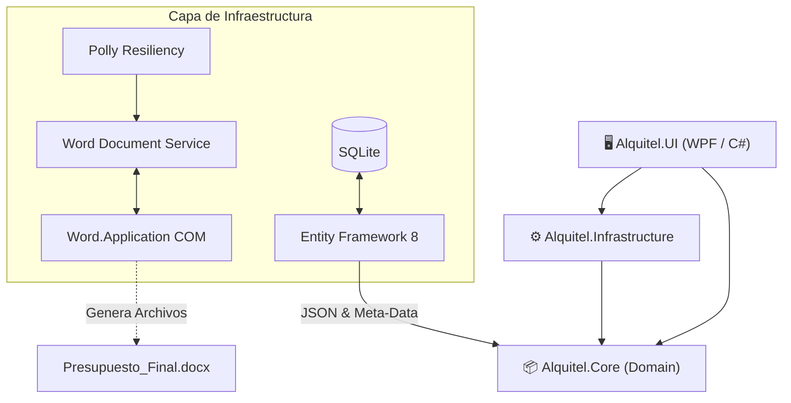
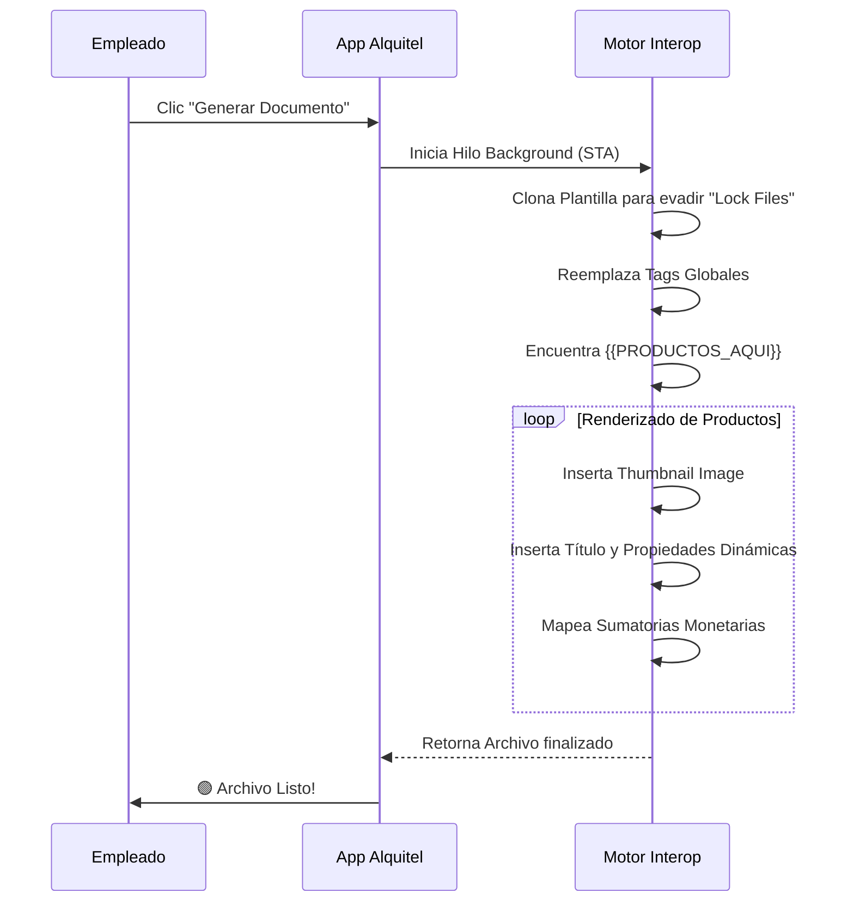

<div align="center">
  
  <h1>🏢 Alquitel - Gestión Corporativa y Documental</h1>
  
  <p>
    
    
    
    
  </p>
  
  <p><i>Automatiza tus presupuestos, optimiza tu logística y olvídate del trabajo manual.</i></p>
</div>

<br>

Sistema integral de gestión interna diseñado específicamente para **Alquitel**, enfocado en la administración de clientes, control de pedidos y generación **100% automatizada** de documentación comercial y técnica, a través de una integración profunda y dinámica con Microsoft Word.

> [!NOTE]
> Esta versión (v2.0) introduce un motor algorítmico de parsing de texto y soporte completo de campos dinámicos para presupuestos adaptables, convirtiéndola en la actualización más importante del ecosistema.

---

## 📑 Tabla de Contenidos
1. [🎯 Casos de Uso y Valor de Negocio](#-casos-de-uso-y-valor-de-negocio)
2. [✨ Novedades y Evolución del Sistema (v2.0)](#-novedades-y-evolución-del-sistema-v20)
3. [🏗️ Arquitectura del Sistema](#️-arquitectura-del-sistema)
4. [📂 Estructura de Directorios](#-estructura-de-directorios)
5. [🚀 Requisitos de Ejecución e Instalación](#-requisitos-de-ejecución-e-instalación)
6. [📄 Funcionamiento del Motor de Documentos](#-funcionamiento-del-motor-de-documentos)
7. [🛠️ Stack Tecnológico Completo](#️-stack-tecnológico-completo)
8. [⚠️ Resolución de Problemas (Troubleshooting)](#️-resolución-de-problemas-troubleshooting)

---

## 🎯 Casos de Uso y Valor de Negocio

La plataforma Alquitel no es solo un gestor de bases de datos, es un **acelerador de flujos de trabajo**. Diseñado para ahorrarle horas al área comercial y al área técnica:

- **Cotizaciones en Segundos**: Copiando un correo de un cliente ("Necesito 3 pantallas y 2 notebooks por 3 días"), el **Buscador Inteligente** inserta los productos en el carrito de manera automática.
- **Doble Perfil de Documentos**: Con un solo clic se genera la cotización para el cliente (con precios de alquiler) y la **Orden de Trabajo (OT)** técnica (ocultando precios, mostrando especificaciones de cableado o logística).
- **Adiós a los Errores de Tipeo**: Al conectar la base de datos de SQLite directamente con el archivo `.docx` corporativo, los errores de importes y matemáticas en presupuestos desaparecen por completo.

---

## ✨ Novedades y Evolución del Sistema (v2.0)

El sistema ha sido reescrito desde cero a nivel de UI y Word Interop para dejar atrás limitaciones rígidas. Las nuevas implementaciones son:

### 1. 🧠 Búsqueda Inteligente (Smart Search Engine)
Un potente motor algorítmico (basado en _Coeficientes de Dice_ y _extracción de Trigramas_) capaz de analizar lenguaje natural y **detectar automáticamente los productos, cantidades y días**.

### 2. 🎛️ Arquitectura de Campos Dinámicos en JSON
Los productos ya no dependen de propiedades estáticas (columnas SQL fijas). Implementamos un sistema visual donde los usuarios configuran **Campos Dinámicos** (ilimitados) decidiendo el color, la negrita y los detalles técnicos. Toda esta meta-data viaja automáticamente a los Presupuestos.

### 3. 📄 Nuevo Motor de Generación Dinámica (Interop Optimizado)
Adiós al bloqueo o congelamiento de MS Word. El motor ha sido optimizado con **STA Threads (Single-Threaded Apartments)** y reemplazó las tablas viejas por la super-etiqueta `{{PRODUCTOS_AQUI}}`:
- **Inyección de Imágenes**: Mapea e inserta imágenes (100x100) en el catálogo de salida.
- **Evade COM Exceptions**: Nuevo parche que soluciona los clásicos problemas de formato y *rango inaccesible* al interactuar con tablas de Word.

### 4. 🌙 Interfaz Premium UX y Dark Mode
Aplicación de un diseño sobrio, oscuro e institucional. Incluye animaciones fluidas, pestañas contextuales ("Presupuesto Comercial" vs "Orden de Trabajo") y validaciones reactivas instantáneas.

### 5. ⚙️ Configurador de Rutas Flexibles
Panel integrado para asignar la carpeta de destino y el archivo Plantilla (`template.docx`). Ideal para trabajar sobre una cuenta compartida de **OneDrive** sin que las rutas queden bloqueadas.

---

## 🏗️ Arquitectura del Sistema

La solución aplica el patrón **MVVM** bajo los lineamientos de _Clean Architecture_.



---

## 📂 Estructura de Directorios

> [!TIP]
> Se aconseja replicar esta estructura en su directorio raíz (Ej: `C:\Alquitel\`) para simplificar el autoguardado.

```text
Alquitel/
├── Alquitel.Core/           # Capa de Dominio (Modelos: Order, Product, Client)
├── Alquitel.Infrastructure/ # Capa de Datos (DbSet) y Servicios Externos (Word)
├── Alquitel.UI/             # Capa Visual (Ventanas WPF, ViewModels)
├── 1_PRESUPUESTOS/          # Salida recomendada para cotizaciones comerciales
├── 2_OF/                    # Salida recomendada para Órdenes de Facturación
└── 3_OT/                    # Salida recomendada para Órdenes de Trabajo técnicas
```

---

## 🚀 Requisitos de Ejecución e Instalación

> [!IMPORTANT]  
> Para que el módulo de creación documental funcione, es un requisito insalvable contar con Microsoft Office instalado.

1. **.NET 8 SDK / Runtime** instalado.
2. **Microsoft Word (Versión de Escritorio)**: Las versiones de la "Microsoft Store" a veces no exponen el componente COM, se exige el instalador clásico de Office (`Word.Application`).
3. Permisos de escritura para que la base de datos interna `SQLite` pueda actualizar el esquema localmente.

---

## 📄 Funcionamiento del Motor de Documentos

El funcionamiento del motor es el siguiente: el `BudgetBuilderViewModel` recoge la estructura de datos temporal y la envía a `WordDocumentService` que inicia un subproceso asíncrono para no trabar la interfaz gráfica.

### Etiquetas Soportadas
Cualquier plantilla `.docx` reconocerá lo siguiente:
- `[CLIENTE]`, `{{CLIENTE}}` -> Extrae el Razón Social.
- `[CUIT]`, `{{CUIT}}` -> CUIT del Cliente.
- `[NUMERO]`, `{{NUMERO}}` -> Correlativo.
- `(fecha)` -> Fecha generada.

### El Tag Mágico: `{{PRODUCTOS_AQUI}}`
Este tag es el corazón de la modernización. Al ejecutarse la generación documental, Word borrará el texto y armará el layout tabla por tabla de forma invisible.



---

## 🛠️ Stack Tecnológico Completo

| Capa | Tecnología Utilizada | Detalle |
| :--- | :--- | :--- |
| **Frontend UI** | `C# 12`, `WPF`, `XAML` | Framework nativo de escritorio Windows de alto desempeño. |
| **Patrón Reactivo** | `CommunityToolkit.Mvvm` | Data-Binding bidireccional moderno sin código espagueti. |
| **Framework Base** | `.NET 8.0` | Target `net8.0-windows` estricto (no cross-platform debido al COM). |
| **Persistencia** | `EF Core Sqlite` | Base de datos embebida (`Microsoft.EntityFrameworkCore.Sqlite`). |
| **Resiliencia** | `Polly` | Algoritmos de reintento exponencial ante fallos de disco duro (I/O). |
| **Automatización** | `dynamic` COM | Enlace tardío para compatibilidad con Word 2013, 2016, 2019, 365. |

---

## 💻 Compilación y CLI

Para modificar el software localmente:

```bash
# 1. Clonar repositorio
git clone <url-repo>
cd Alquitel

# 2. Compilar dependencias
dotnet restore

# 3. Ejecutar en Debug
dotnet run --project Alquitel.UI\Alquitel.UI.csproj

# 4. Generar ejecutable de Producción autónomo (Self-Contained)
dotnet publish Alquitel.UI\Alquitel.UI.csproj -c Release -r win-x64 --self-contained true -p:PublishSingleFile=true
```

---

## ⚠️ Resolución de Problemas (Troubleshooting)

> [!WARNING]
> **El proceso de Generación se traba o tarda 60 segundos**: Esto ocurre típicamente si el documento de destino está siendo utilizado por otro programa, o si el usuario no tiene permisos de guardado en la carpeta de la nube (OneDrive). `Polly` hará 5 reintentos silenciados antes de mostrar el cartel de error rojo. Cerrá Word y volvé a intentarlo.

> [!CAUTION]
> **Microsoft Word No Responde o No Inicializa**: Asegúrate de que tu MS Word no esté corriendo en un entorno aislado (Sandbox) y de no usar cuentas no activadas. Un "Reparar Office" de Windows lo resuelve el 99% de las veces.

- **La tabla de productos se ve "chueca" o sin imágenes**: Verifica que la imagen configurada en tu catálogo exista físicamente en tu disco duro en la ruta provista. Si la imagen se borró o movió, el motor simplemente emitirá el texto sin romper el documento completo.

---
*© 2026 Alquitel - Gestión Innovadora para Arquitectura de Eventos.*
