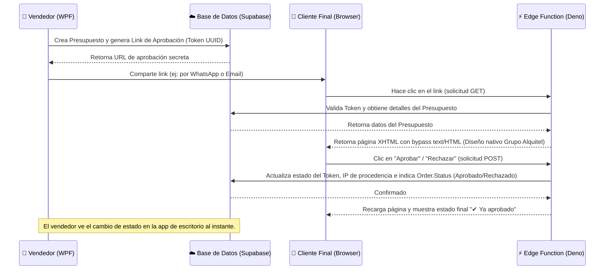
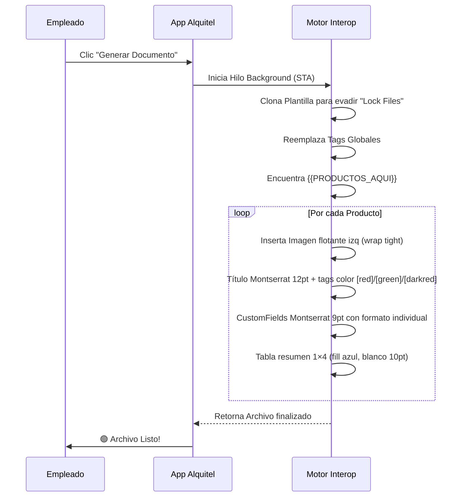

<div align="center">
  
  <h1>🏢 Alquitel - Gestión Corporativa y Documental</h1>
  
  <p>
    
    
    
    
  </p>
  
  <p><i>Automatiza tus presupuestos, optimiza tu logística y olvídate del trabajo manual.</i></p>
</div>

<br>

Sistema integral de gestión interna diseñado específicamente para **Alquitel**, enfocado en la administración de clientes, control de pedidos y generación **100% automatizada** de documentación comercial y técnica, a través de una integración profunda y dinámica con Microsoft Word.

> [!NOTE]
> Esta versión (v2.0) introduce un motor algorítmico de parsing de texto y soporte completo de campos dinámicos para presupuestos adaptables, convirtiéndola en la actualización más importante del ecosistema.

---

## 📑 Tabla de Contenidos
1. [🎯 Casos de Uso y Valor de Negocio](#-casos-de-uso-y-valor-de-negocio)
2. [✨ Novedades y Evolución del Sistema (v2.0)](#-novedades-y-evolución-del-sistema-v20)
3. [🏗️ Arquitectura del Sistema](#️-arquitectura-del-sistema)
4. [🌐 Flujo de Aprobación de Presupuestos (Online)](#-flujo-de-aprobación-de-presupuestos-online)
5. [📂 Estructura de Directorios](#-estructura-de-directorios)
6. [🚀 Requisitos de Ejecución e Instalación](#-requisitos-de-ejecución-e-instalación)
7. [📄 Funcionamiento del Motor de Documentos](#-funcionamiento-del-motor-de-documentos)
8. [🛠️ Stack Tecnológico Completo](#️-stack-tecnológico-completo)
9. [⚠️ Resolución de Problemas (Troubleshooting)](#️-resolución-de-problemas-troubleshooting)

---

## 🎯 Casos de Uso y Valor de Negocio

La plataforma Alquitel no es solo un gestor de bases de datos, es un **acelerador de flujos de trabajo**. Diseñado para ahorrarle horas al área comercial y al área técnica:

- **Cotizaciones en Segundos**: Copiando un correo de un cliente ("Necesito 3 pantallas y 2 notebooks por 3 días"), el **Buscador Inteligente** inserta los productos en el carrito de manera automática.
- **Doble Perfil de Documentos**: Con un solo clic se genera la cotización para el cliente (con precios de alquiler) y la **Orden de Trabajo (OT)** técnica (ocultando precios, mostrando especificaciones de cableado o logística).
- **Adiós a los Errores de Tipeo**: Al conectar la base de datos de SQLite directamente con el archivo `.docx` corporativo, los errores de importes y matemáticas en presupuestos desaparecen por completo.
- **Aprobación del Cliente a un Clic**: Generación automática de links secretos de aprobación. El cliente abre el link, visualiza la cotización en su navegador (móvil o PC) y puede aprobar o rechazar directamente, actualizando el estado del pedido al instante en la app de escritorio.

---

## ✨ Novedades y Evolución del Sistema (v2.0)

El sistema ha sido reescrito desde cero a nivel de UI y Word Interop para dejar atrás limitaciones rígidas. Las nuevas implementaciones son:

### 1. 🧠 Búsqueda Inteligente (Smart Search Engine)
Un potente motor algorítmico (basado en _Coeficientes de Dice_ y _extracción de Trigramas_) capaz de analizar lenguaje natural y **detectar automáticamente los productos, cantidades y días**.

### 2. 🎛️ Arquitectura de Campos Dinámicos en JSON
Los productos ya no dependen de propiedades estáticas (columnas SQL fijas). Implementamos un sistema visual donde los usuarios configuran:
- **Descripción Segmentada**: Título del producto dividido en fragmentos independientes, cada uno con color (Negro, Rojo, Verde, Rojo Oscuro), negrita e itálica. Ideal para destacar especificaciones (ej: "Pantalla de Leds 2 mm - **Para interior – FLEX – Vertical**" con colores).
- **Campos Dinámicos** (ilimitados): Propiedades técnicas (resolución, peso, consumo, etc.) con color y formato independiente.
Toda esta meta-data viaja automáticamente a los Presupuestos renderizados en Word.

### 3. 📄 Nuevo Motor de Generación Dinámica (Interop Optimizado)
Adiós al bloqueo o congelamiento de MS Word. El motor ha sido optimizado con **STA Threads (Single-Threaded Apartments)** y reemplazó las tablas viejas por la super-etiqueta `{{PRODUCTOS_AQUI}}`:
- **Inyección de Imágenes**: Mapea e inserta imágenes (100x100) en el catálogo de salida.
- **Evade COM Exceptions**: Nuevo parche que soluciona los clásicos problemas de formato y *rango inaccesible* al interactuar con tablas de Word.

### 4. 🌙 Interfaz Premium UX y Dark Mode
Aplicación de un diseño sobrio, oscuro e institucional. Incluye animaciones fluidas, pestañas contextuales ("Presupuesto Comercial" vs "Orden de Trabajo") y validaciones reactivas instantáneas.

### 5. ⚙️ Configurador de Rutas Flexibles
Panel integrado para asignar la carpeta de destino y el archivo Plantilla (`template.docx`). Ideal para trabajar sobre una cuenta compartida de **OneDrive** sin que las rutas queden bloqueadas.

### 6. 🌐 Portal de Aprobación de Presupuestos (Online & Cloud Sync)
Integración asíncrona con **Supabase** que permite generar links únicos de aprobación para presupuestos:
- **Bypass de Restricciones del Gateway**: Emplea una cabecera especializada `text/HTML` (case-sensitive) para burlar la reescritura de Kong a `text/plain`, asegurando que el navegador renderice la página con sus estilos y scripts interactivos intactos.
- **Transiciones Automáticas**: Al aprobar, actualiza concurrentemente el registro y el estatus de la orden (`Orders.Status`) en la nube, sincronizando los datos con la app local del vendedor de forma automática.

---

## 🏗️ Arquitectura del Sistema

La solución aplica el patrón **MVVM** bajo los lineamientos de _Clean Architecture_.

```mermaid
graph TD
    UI["🖥️ Alquitel.UI (WPF / C#)"] --> Core["📦 Alquitel.Core (Domain)"]
    Infra["⚙️ Alquitel.Infrastructure"] --> Core
    UI --> Infra
    
    subgraph Capa de Infraestructura (Local)
        DB_Local[(SQLite)] <--> EF_Local["EF Core (SQLite)"]
        Word["Word Document Service"] <--> COM["Word.Application COM"]
        Polly["Polly Resiliency"] --> Word
    end
    
    subgraph Capa Nube e Interacción (Supabase)
        SupaDB[(PostgreSQL / Supabase)] <--> EF_Supa["EF Core (PostgreSql)"]
        EdgeFn["⚡ Edge Function: aprobar"] <--> SupaDB
        Browser["📱 Cliente Final (Navegador)"] <--> |GET / POST| EdgeFn
    end
    
    UI -.-> |Sincroniza Estado| EF_Supa
    EF_Local --> Core
    COM -.-> |Genera Archivos| Docs["Presupuesto_Final.docx"]
```

---

## 🌐 Flujo de Aprobación de Presupuestos (Online)

La plataforma utiliza un ecosistema híbrido local-nube para procesar la interacción con el cliente final sin comprometer la base de datos de escritorio.



### Componentes Involucrados:
1. **Generación del Link (WPF / C#):** El servicio `EfApprovalLinkService` inserta una tupla en `OrderApprovals` con un token único de tipo `UUID` y genera el link público apuntando a la Edge Function de Supabase.
2. **Servicio Edge Function (`aprobar` en Deno/TS):** Alojado en el directorio local `supabase/functions/aprobar/index.ts` y desplegado en la nube. Escucha llamadas `GET` para renderizar el portal e interacciones `POST` para registrar la decisión del cliente.
3. **Bypass de Visualización de Código Fuente (Kong Gateway):**
   Para evitar que el gateway reescriba la página a `text/plain`, se devuelve la cabecera `Content-Type: text/HTML; charset=utf-8`. El gateway de Supabase procesa de forma sensible a mayúsculas y no detecta `"text/html"`, mientras que el navegador lo recibe y normaliza, renderizando el portal nativo interactivo.

---

## 📂 Estructura de Directorios

> [!TIP]
> Se aconseja replicar esta estructura en su directorio raíz (Ej: `C:\Alquitel\`) para simplificar el autoguardado.

```text
Alquitel/
├── Alquitel.Core/           # Capa de Dominio (Modelos: Order, Product, Client)
├── Alquitel.Infrastructure/ # Capa de Datos (DbSet) y Servicios Externos (Word)
├── Alquitel.UI/             # Capa Visual (Ventanas WPF, ViewModels)
├── supabase/                # Configuraciones de Base de Datos y Edge Functions
│   ├── functions/aprobar/   # Código fuente Deno/TypeScript del portal de aprobación
│   └── migrations/          # Migraciones SQL para PostgreSQL en Supabase
├── 1_PRESUPUESTOS/          # Salida recomendada para cotizaciones comerciales
├── 2_OF/                    # Salida recomendada para Órdenes de Facturación
└── 3_OT/                    # Salida recomendada para Órdenes de Trabajo técnicas
```

---

## 🚀 Requisitos de Ejecución e Instalación

> [!IMPORTANT]  
> Para que el módulo de creación documental funcione, es un requisito insalvable contar con Microsoft Office instalado.

1. **.NET 8 SDK / Runtime** instalado.
2. **Microsoft Word (Versión de Escritorio)**: Las versiones de la "Microsoft Store" a veces no exponen el componente COM, se exige el instalador clásico de Office (`Word.Application`).
3. Permisos de escritura para que la base de datos interna `SQLite` pueda actualizar el esquema localmente.

### 🔐 Configuración de Secretos y Variables de Entorno

Alquitel no almacena secretos en `appsettings.json` (solo endpoints y claves públicas anónimas). Los valores sensibles por máquina o de producción se configuran mediante **variables de entorno** con prefijo `ALQUITEL_` o mediante el archivo `appsettings.local.json` (ubicado en la raíz de ejecución y excluido en `.gitignore`):

| Configuración | Variable de Entorno | Ejemplo / Formato |
|---|---|---|
| Proveedor de Base de Datos | `ALQUITEL_Database__Provider` | `sqlite` (por defecto) o `supabase` |
| Cadena de conexión PostgreSQL | `ALQUITEL_Database__Supabase__ConnectionString` | `Host=...;Port=5432;Database=postgres;Username=...;Password=...` |
| Clave de Servicio Supabase | `ALQUITEL_Supabase__ServiceKey` | Clave JWT privada del rol de servicio |
| API Key Asistente IA | `ALQUITEL_Ai__Pollinations__ApiKey` | Token de acceso para modelo de lenguaje |

> [!TIP]
> Para el entorno de desarrollo local basta con SQLite; no se requiere configurar cadenas de conexión remotas. Para usar Supabase, copie `appsettings.local.example.json` a `appsettings.local.json` y complete las credenciales de su proyecto.

### 🛡️ Hook Anti-Secretos (Pre-Commit)

Para evitar filtraciones accidentales de tokens JWT (`eyJ...`) o claves de API (`sk_...`), active el hook provisto una vez por clon del repositorio:

```bash
git config core.hooksPath .githooks
```

### 🔏 Firma Digital Authenticode

- **En desarrollo local**: Los scripts de compilación firman automáticamente los binarios con un certificado autofirmado local (`CN=AlquitelLocalDev`) para evitar bloqueos por parte de Windows Smart App Control. Se puede generar con `scripts/setup_dev_cert.ps1`.
- **En Integración Continua (CI/CD)**: La firma de producción se realiza mediante certificados corporativos inyectados exclusivamente desde el almacén de secretos de GitHub (`ACTIONS_CERTIFICATE_PFX` y `ACTIONS_CERTIFICATE_PASSWORD`), sin versionar nunca certificados ni claves privadas en el repositorio.

---

## 📄 Funcionamiento del Motor de Documentos

El funcionamiento del motor es el siguiente: el `BudgetBuilderViewModel` recoge la estructura de datos temporal y la envía a `WordDocumentService` que inicia un subproceso asíncrono para no trabar la interfaz gráfica.

### Etiquetas Soportadas

**Placeholders Globales:**
- `[CLIENTE]`, `{{CLIENTE}}` → Razón Social del Cliente.
- `[CUIT]`, `{{CUIT}}` → CUIT del Cliente.
- `[NUMERO]`, `{{NUMERO}}` → Número de Presupuesto.
- `(fecha)` → Fecha generada.

**Tags Inline en Descripción de Productos:**
Dentro del campo **Descripción Segmentada**, se pueden usar los tags inline (aunque recomendamos usar el editor visual):
- `[red]...[/red]` → Texto en Rojo.
- `[green]...[/green]` → Texto en Verde.
- `[darkred]...[/darkred]` → Texto en Rojo Oscuro.
- `[b]...[/b]` → Negrita.
- `[i]...[/i]` → Cursiva.

Ejemplo: `Pantalla de Leds 2 mm - [red]Para interior – [/red][green]FLEX[/green] [darkred][i]– Vertical[/i][/darkred]`

### El Tag Mágico: `{{PRODUCTOS_AQUI}}`
Este tag es el corazón de la modernización. Al ejecutarse la generación documental, Word borrará el texto y armará el layout producto por producto de forma invisible.

**Renderizado de cada Producto:**
1. **Título Segmentado**: Imagen flotante a la izquierda (2.5×2.5cm, envuelto en texto). Título en Montserrat 12pt bold con colores inline `[red]...[/red]`, `[green]...[/green]`, `[darkred]...[/darkred]`.
2. **Detalles Dinámicos**: Párrafos Montserrat 9pt con CustomFields. Cada campo aplica color, negrita, subrayado según su configuración.
3. **Medida Solicitada** (si existe): "Medida solicitada: " bold subrayado + valor coloreado en rojo.
4. **Tabla Resumen**: 1×4 con celda fill azul `#1F68C7`, texto blanco bold 10pt. Cant.: | Días: | Costo U.: | Total: $.



---

## 🛠️ Stack Tecnológico Completo

| Capa | Tecnología Utilizada | Detalle |
| :--- | :--- | :--- |
| **Frontend UI** | `C# 12`, `WPF`, `XAML` | Framework nativo de escritorio Windows de alto desempeño. |
| **Patrón Reactivo** | `CommunityToolkit.Mvvm` | Data-Binding bidireccional moderno sin código espagueti. |
| **Framework Base** | `.NET 8.0` | Target `net8.0-windows` estricto (no cross-platform debido al COM). |
| **Persistencia** | `EF Core Sqlite` | Base de datos embebida (`Microsoft.EntityFrameworkCore.Sqlite`). |
| **Resiliencia** | `Polly` | Algoritmos de reintento exponencial ante fallos de disco duro (I/O). |
| **Automatización** | `dynamic` COM | Enlace tardío para compatibilidad con Word 2013, 2016, 2019, 365. |

---

## 💻 Compilación y CLI

Para modificar el software localmente:

```bash
# 1. Clonar repositorio
git clone <url-repo>
cd Alquitel

# 2. Compilar dependencias
dotnet restore

# 3. Ejecutar en Debug
dotnet run --project Alquitel.UI\Alquitel.UI.csproj

# 4. Generar ejecutable de Producción autónomo (Self-Contained)
dotnet publish Alquitel.UI\Alquitel.UI.csproj -c Release -r win-x64 --self-contained true -p:PublishSingleFile=true
```

---

## 📝 Guía: Editor de Productos con Descripción Segmentada

Al crear o editar un producto, la **Descripción** se construye mediante segmentos independientes:

1. **Añadir Segmento**: Botón "Añadir Segmento" crea un nuevo campo de texto.
2. **Personalizar cada Segmento**:
   - **Texto**: Contenido del fragmento (ej: "Pantalla de Leds 2 mm - ").
   - **Color**: Selector visual (Negro, Rojo `#FF0000`, Verde `#006600`, Rojo Oscuro `#C00000`).
   - **Negrita (N)**: Checkbox para aplicar bold.
   - **Cursiva (I)**: Checkbox para aplicar italic.
   - **Eliminar**: Botón rojo `✕`.

3. **Vista Previa en Vivo**: Border superior muestra cómo se vería en el presupuesto (colores reales, estilos aplicados).

**Ejemplo** (Pantalla LED):
| Segmento | Texto | Color | N | I |
|----------|-------|-------|---|---|
| 1 | Pantalla de Leds 2 mm - | Negro | ✓ | |
| 2 | Para interior – | Rojo | ✓ | |
| 3 | FLEX | Verde | ✓ | |
| 4 | – Vertical | Rojo Oscuro | ✓ | ✓ |

Los segmentos se concatenan automáticamente al guardar. En el presupuesto aparecerán exactamente como se vea en la vista previa.

---

## 🌟 Estado Actual y Roadmap Técnico (2026)

> [!NOTE]
> Tras una refactorización intensiva, la arquitectura del sistema ha alcanzado un alto grado de madurez técnica. 
> Todos los problemas históricos críticos (DbContext Singleton, Logging silenciado, Hardcoding de rutas, validaciones de CUIT y dependencias acopladas) **han sido solucionados con éxito**.

### 🎯 Hitos Completados
- ✅ **Clean Architecture Plena**: Separación estricta entre `UI`, `Core` e `Infrastructure` con contenedores de Inyección de Dependencias (DI) configurados correctamente.
- ✅ **Base de Datos Robusta**: Manejo de concurrencia optimizado mediante un `Scoped DbContextFactory`. Se implementó un historial transaccional inviolable usando "Soft Deletes" y snapshots dinámicos de las descripciones.
- ✅ **Observabilidad Total**: Integración nativa de **Serilog** y captura global de excepciones, erradicando los antiguos bloques catch silenciosos y garantizando visibilidad total de incidentes.
- ✅ **Motor Documental Inteligente**: Motor asíncrono STA-Threaded que interactúa fluidamente con Microsoft Word en un hilo de fondo (background thread), evitando el congelamiento de la interfaz gráfica de usuario.

---

### 🚀 Roadmap Futuro (Backlog)

La aplicación es completamente estable y funcional en entornos de producción, pero siempre hay espacio para expandir su valor. Las siguientes áreas están proyectadas para futuras iteraciones:

#### 1. 📦 Despliegue y Auto-Updates (OTA)
Aunque el servicio de actualizaciones (`VelopackUpdateService`) ya se encuentra acoplado en el núcleo de la aplicación, falta definir un repositorio de distribución en la nube (ej. *AWS S3*, *GitHub Releases* o *Supabase Storage*).
- **Objetivo**: Lograr que las computadoras de los representantes comerciales se actualicen silenciosamente al iniciar, sin requerir intervención manual del equipo de IT.

#### 2. ⚡ Reemplazo de Word Interop (COM)
Actualmente, el sistema depende de una instalación local íntegra de Microsoft Word y usa COM Interop, lo cual es susceptible a bloqueos por la "Vista Protegida" de Office.
- **Objetivo**: Migrar el renderizador a `DocumentFormat.OpenXml` o librerías nativas como `DocX`. 
- **Beneficio**: Generación de documentos instantánea (*headless*), sin depender del proceso pesadísimo `WINWORD.EXE`.

#### 3. 📊 Dashboard de Inteligencia de Negocio
El proyecto ya cuenta con el paquete gráfico `LiveChartsCore` instalado en su versión más reciente.
- **Objetivo**: Evolucionar la pantalla de inicio estática para incluir gráficas interactivas en tiempo real sobre volumen de facturación mensual, porcentaje de conversión de presupuestos y un ranking del top 5 de productos más solicitados.

#### 4. 📄 Exportación Directa a PDF
El motor documental ya expone en su firma de métodos un parámetro para exportar a PDF, pero esta función permanece oculta para el flujo de trabajo estándar.
- **Objetivo**: Incluir un botón de un solo clic **"Generar y Exportar a PDF"** en el visualizador (PresupuestosViewModel), para acelerar el envío de cotizaciones y OTs por plataformas de mensajería (WhatsApp/Email).

---

## ⚠️ Resolución de Problemas (Troubleshooting)

> [!WARNING]
> **El proceso de Generación se traba o tarda 60 segundos**: Esto ocurre típicamente si el documento de destino está siendo utilizado por otro programa, o si el usuario no tiene permisos de guardado en la carpeta de la nube (OneDrive). `Polly` hará 5 reintentos silenciados antes de mostrar el cartel de error rojo. Cerrá Word y volvé a intentarlo.

> [!CAUTION]
> **Microsoft Word No Responde o No Inicializa**: Asegúrate de que tu MS Word no esté corriendo en un entorno aislado (Sandbox) y de no usar cuentas no activadas. Un "Reparar Office" de Windows lo resuelve el 99% de las veces.

- **La tabla de productos se ve "chueca" o sin imágenes**: Verifica que la imagen configurada en tu catálogo exista físicamente en tu disco duro en la ruta provista. Si la imagen se borró o movió, el motor simplemente emitirá el texto sin romper el documento completo.

---
*© 2026 Alquitel - Gestión Innovadora para Arquitectura de Eventos.*