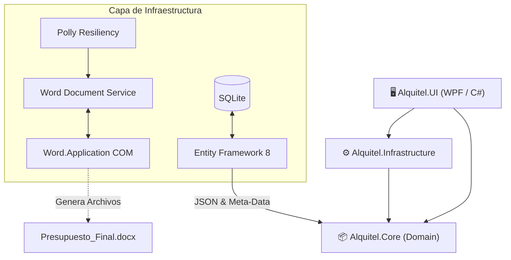
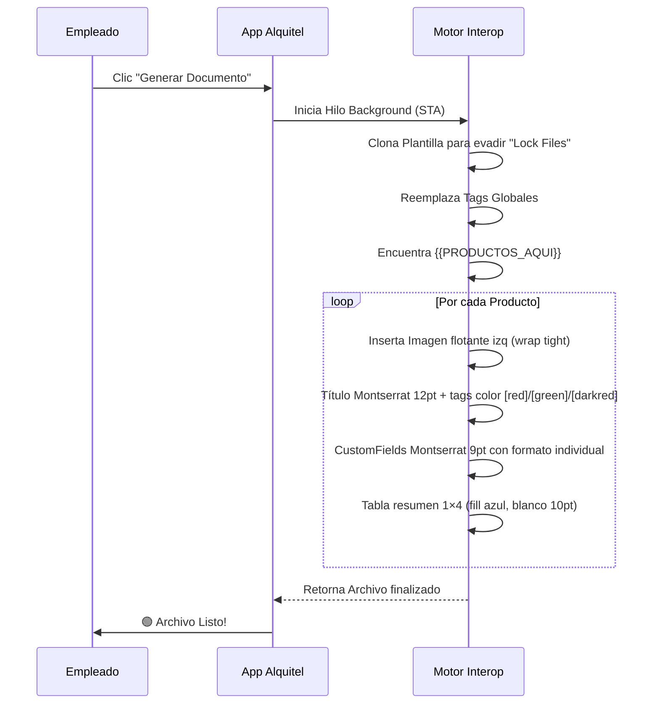

<div align="center">
  
  <h1>🏢 Alquitel - Gestión Corporativa y Documental</h1>
  
  <p>
    
    
    
    
  </p>
  
  <p><i>Automatiza tus presupuestos, optimiza tu logística y olvídate del trabajo manual.</i></p>
</div>

<br>

Sistema integral de gestión interna diseñado específicamente para **Alquitel**, enfocado en la administración de clientes, control de pedidos y generación **100% automatizada** de documentación comercial y técnica, a través de una integración profunda y dinámica con Microsoft Word.

> [!NOTE]
> Esta versión (v2.0) introduce un motor algorítmico de parsing de texto y soporte completo de campos dinámicos para presupuestos adaptables, convirtiéndola en la actualización más importante del ecosistema.

---

## 📑 Tabla de Contenidos
1. [🎯 Casos de Uso y Valor de Negocio](#-casos-de-uso-y-valor-de-negocio)
2. [✨ Novedades y Evolución del Sistema (v2.0)](#-novedades-y-evolución-del-sistema-v20)
3. [🏗️ Arquitectura del Sistema](#️-arquitectura-del-sistema)
4. [📂 Estructura de Directorios](#-estructura-de-directorios)
5. [🚀 Requisitos de Ejecución e Instalación](#-requisitos-de-ejecución-e-instalación)
6. [📄 Funcionamiento del Motor de Documentos](#-funcionamiento-del-motor-de-documentos)
7. [🛠️ Stack Tecnológico Completo](#️-stack-tecnológico-completo)
8. [⚠️ Resolución de Problemas (Troubleshooting)](#️-resolución-de-problemas-troubleshooting)

---

## 🎯 Casos de Uso y Valor de Negocio

La plataforma Alquitel no es solo un gestor de bases de datos, es un **acelerador de flujos de trabajo**. Diseñado para ahorrarle horas al área comercial y al área técnica:

- **Cotizaciones en Segundos**: Copiando un correo de un cliente ("Necesito 3 pantallas y 2 notebooks por 3 días"), el **Buscador Inteligente** inserta los productos en el carrito de manera automática.
- **Doble Perfil de Documentos**: Con un solo clic se genera la cotización para el cliente (con precios de alquiler) y la **Orden de Trabajo (OT)** técnica (ocultando precios, mostrando especificaciones de cableado o logística).
- **Adiós a los Errores de Tipeo**: Al conectar la base de datos de SQLite directamente con el archivo `.docx` corporativo, los errores de importes y matemáticas en presupuestos desaparecen por completo.

---

## ✨ Novedades y Evolución del Sistema (v2.0)

El sistema ha sido reescrito desde cero a nivel de UI y Word Interop para dejar atrás limitaciones rígidas. Las nuevas implementaciones son:

### 1. 🧠 Búsqueda Inteligente (Smart Search Engine)
Un potente motor algorítmico (basado en _Coeficientes de Dice_ y _extracción de Trigramas_) capaz de analizar lenguaje natural y **detectar automáticamente los productos, cantidades y días**.

### 2. 🎛️ Arquitectura de Campos Dinámicos en JSON
Los productos ya no dependen de propiedades estáticas (columnas SQL fijas). Implementamos un sistema visual donde los usuarios configuran:
- **Descripción Segmentada**: Título del producto dividido en fragmentos independientes, cada uno con color (Negro, Rojo, Verde, Rojo Oscuro), negrita e itálica. Ideal para destacar especificaciones (ej: "Pantalla de Leds 2 mm - **Para interior – FLEX – Vertical**" con colores).
- **Campos Dinámicos** (ilimitados): Propiedades técnicas (resolución, peso, consumo, etc.) con color y formato independiente.
Toda esta meta-data viaja automáticamente a los Presupuestos renderizados en Word.

### 3. 📄 Nuevo Motor de Generación Dinámica (Interop Optimizado)
Adiós al bloqueo o congelamiento de MS Word. El motor ha sido optimizado con **STA Threads (Single-Threaded Apartments)** y reemplazó las tablas viejas por la super-etiqueta `{{PRODUCTOS_AQUI}}`:
- **Inyección de Imágenes**: Mapea e inserta imágenes (100x100) en el catálogo de salida.
- **Evade COM Exceptions**: Nuevo parche que soluciona los clásicos problemas de formato y *rango inaccesible* al interactuar con tablas de Word.

### 4. 🌙 Interfaz Premium UX y Dark Mode
Aplicación de un diseño sobrio, oscuro e institucional. Incluye animaciones fluidas, pestañas contextuales ("Presupuesto Comercial" vs "Orden de Trabajo") y validaciones reactivas instantáneas.

### 5. ⚙️ Configurador de Rutas Flexibles
Panel integrado para asignar la carpeta de destino y el archivo Plantilla (`template.docx`). Ideal para trabajar sobre una cuenta compartida de **OneDrive** sin que las rutas queden bloqueadas.

---

## 🏗️ Arquitectura del Sistema

La solución aplica el patrón **MVVM** bajo los lineamientos de _Clean Architecture_.



---

## 📂 Estructura de Directorios

> [!TIP]
> Se aconseja replicar esta estructura en su directorio raíz (Ej: `C:\Alquitel\`) para simplificar el autoguardado.

```text
Alquitel/
├── Alquitel.Core/           # Capa de Dominio (Modelos: Order, Product, Client)
├── Alquitel.Infrastructure/ # Capa de Datos (DbSet) y Servicios Externos (Word)
├── Alquitel.UI/             # Capa Visual (Ventanas WPF, ViewModels)
├── 1_PRESUPUESTOS/          # Salida recomendada para cotizaciones comerciales
├── 2_OF/                    # Salida recomendada para Órdenes de Facturación
└── 3_OT/                    # Salida recomendada para Órdenes de Trabajo técnicas
```

---

## 🚀 Requisitos de Ejecución e Instalación

> [!IMPORTANT]  
> Para que el módulo de creación documental funcione, es un requisito insalvable contar con Microsoft Office instalado.

1. **.NET 8 SDK / Runtime** instalado.
2. **Microsoft Word (Versión de Escritorio)**: Las versiones de la "Microsoft Store" a veces no exponen el componente COM, se exige el instalador clásico de Office (`Word.Application`).
3. Permisos de escritura para que la base de datos interna `SQLite` pueda actualizar el esquema localmente.

---

## 📄 Funcionamiento del Motor de Documentos

El funcionamiento del motor es el siguiente: el `BudgetBuilderViewModel` recoge la estructura de datos temporal y la envía a `WordDocumentService` que inicia un subproceso asíncrono para no trabar la interfaz gráfica.

### Etiquetas Soportadas

**Placeholders Globales:**
- `[CLIENTE]`, `{{CLIENTE}}` → Razón Social del Cliente.
- `[CUIT]`, `{{CUIT}}` → CUIT del Cliente.
- `[NUMERO]`, `{{NUMERO}}` → Número de Presupuesto.
- `(fecha)` → Fecha generada.

**Tags Inline en Descripción de Productos:**
Dentro del campo **Descripción Segmentada**, se pueden usar los tags inline (aunque recomendamos usar el editor visual):
- `[red]...[/red]` → Texto en Rojo.
- `[green]...[/green]` → Texto en Verde.
- `[darkred]...[/darkred]` → Texto en Rojo Oscuro.
- `[b]...[/b]` → Negrita.
- `[i]...[/i]` → Cursiva.

Ejemplo: `Pantalla de Leds 2 mm - [red]Para interior – [/red][green]FLEX[/green] [darkred][i]– Vertical[/i][/darkred]`

### El Tag Mágico: `{{PRODUCTOS_AQUI}}`
Este tag es el corazón de la modernización. Al ejecutarse la generación documental, Word borrará el texto y armará el layout producto por producto de forma invisible.

**Renderizado de cada Producto:**
1. **Título Segmentado**: Imagen flotante a la izquierda (2.5×2.5cm, envuelto en texto). Título en Montserrat 12pt bold con colores inline `[red]...[/red]`, `[green]...[/green]`, `[darkred]...[/darkred]`.
2. **Detalles Dinámicos**: Párrafos Montserrat 9pt con CustomFields. Cada campo aplica color, negrita, subrayado según su configuración.
3. **Medida Solicitada** (si existe): "Medida solicitada: " bold subrayado + valor coloreado en rojo.
4. **Tabla Resumen**: 1×4 con celda fill azul `#1F68C7`, texto blanco bold 10pt. Cant.: | Días: | Costo U.: | Total: $.



---

## 🛠️ Stack Tecnológico Completo

| Capa | Tecnología Utilizada | Detalle |
| :--- | :--- | :--- |
| **Frontend UI** | `C# 12`, `WPF`, `XAML` | Framework nativo de escritorio Windows de alto desempeño. |
| **Patrón Reactivo** | `CommunityToolkit.Mvvm` | Data-Binding bidireccional moderno sin código espagueti. |
| **Framework Base** | `.NET 8.0` | Target `net8.0-windows` estricto (no cross-platform debido al COM). |
| **Persistencia** | `EF Core Sqlite` | Base de datos embebida (`Microsoft.EntityFrameworkCore.Sqlite`). |
| **Resiliencia** | `Polly` | Algoritmos de reintento exponencial ante fallos de disco duro (I/O). |
| **Automatización** | `dynamic` COM | Enlace tardío para compatibilidad con Word 2013, 2016, 2019, 365. |

---

## 💻 Compilación y CLI

Para modificar el software localmente:

```bash
# 1. Clonar repositorio
git clone <url-repo>
cd Alquitel

# 2. Compilar dependencias
dotnet restore

# 3. Ejecutar en Debug
dotnet run --project Alquitel.UI\Alquitel.UI.csproj

# 4. Generar ejecutable de Producción autónomo (Self-Contained)
dotnet publish Alquitel.UI\Alquitel.UI.csproj -c Release -r win-x64 --self-contained true -p:PublishSingleFile=true
```

---

## 📝 Guía: Editor de Productos con Descripción Segmentada

Al crear o editar un producto, la **Descripción** se construye mediante segmentos independientes:

1. **Añadir Segmento**: Botón "Añadir Segmento" crea un nuevo campo de texto.
2. **Personalizar cada Segmento**:
   - **Texto**: Contenido del fragmento (ej: "Pantalla de Leds 2 mm - ").
   - **Color**: Selector visual (Negro, Rojo `#FF0000`, Verde `#006600`, Rojo Oscuro `#C00000`).
   - **Negrita (N)**: Checkbox para aplicar bold.
   - **Cursiva (I)**: Checkbox para aplicar italic.
   - **Eliminar**: Botón rojo `✕`.

3. **Vista Previa en Vivo**: Border superior muestra cómo se vería en el presupuesto (colores reales, estilos aplicados).

**Ejemplo** (Pantalla LED):
| Segmento | Texto | Color | N | I |
|----------|-------|-------|---|---|
| 1 | Pantalla de Leds 2 mm - | Negro | ✓ | |
| 2 | Para interior – | Rojo | ✓ | |
| 3 | FLEX | Verde | ✓ | |
| 4 | – Vertical | Rojo Oscuro | ✓ | ✓ |

Los segmentos se concatenan automáticamente al guardar. En el presupuesto aparecerán exactamente como se vea en la vista previa.

---

## 🔧 Mejoras Propuestas (Roadmap Técnico)

Esta sección documenta mejoras arquitectónicas, de rendimiento y UX identificadas en análisis profundo del codebase v2.0. Cada mejora incluye contexto, riesgo mitigado y prioridad relativa.

### 1. Persistencia y Base de Datos

#### 1.1 DbContext Singleton → Scoped (🔴 CRÍTICO)
**Problema**: `AddDbContext<AlquitelDbContext>` registrado con `ServiceLifetime.Singleton` viola thread-safety EF Core. Causa: EF mantiene `ChangeTracker` global que no soporta acceso concurrente.
- **Riesgo**: Corrupción de estado tracking, cambios fantasma, inserciones duplicadas.
- **Solución**: Cambiar a `Scoped` + inyectar `IDbContextFactory<AlquitelDbContext>` en cada ViewModel. Cada VM crea contexto para su operación.
- **Impacto**: 3h refactor, cero breaking changes, estabilidad +50%.

#### 1.2 Agregar Entity Framework Migrations (🟡 MEDIO)
**Problema**: `EnsureCreated()` no permite evolución schema. Imposible agregar columnas, índices, cambiar tipos sin perder datos.
- **Solución**: 
  ```bash
  dotnet ef migrations add InitialCreate
  dotnet ef database update
  ```
  Luego: cada cambio schema genera migration automática.
- **Impacto**: 1h setup, infraestructura futura garantizada.

#### 1.3 Snapshot Descripción en OrderItem (🟡 MEDIO)
**Problema**: `OrderItem` copia `ImagePath`, `CustomFieldsJson` del Product al crear. Si Product se edita después, presupuestos viejos recargados muestran nuevo Product.Description (tags/colores cambian). Confusión cuando cliente revisa presupuesto antiguo.
- **Solución**: Agregar campo `DescriptionSnapshot: string` en OrderItem al momento de creación. No cambiar luego. Usar en LoadOrder/RenderProduct.
- **Impacto**: 2h, +1 column, máxima consistencia histórica.

#### 1.4 Soft Delete para Product y Client (🟡 MEDIO)
**Problema**: Borrar Product que tiene FK desde OrderItem existente rompe integridad referencial. DeleteBehavior.Restrict fuerza a cliente a "limpiar presupuestos primero" (inaceptable). DeleteBehavior.Cascade borra todos presupuestos (catastrófico).
- **Solución**: Agregar `IsArchived: bool = false` a Product y Client. UI oculta archivados. Borrado lógico, no físico.
- **Impacto**: 2h, +2 columns, integridad garantizada.

#### 1.5 Índices de Base de Datos (🟢 BAJO)
**Problema**: Sin índices en `Order.CreatedDate`, `Order.ClientId`, `OrderItem.OrderId`. Consultas lentas si DB crece.
- **Solución**: En `OnModelCreating`:
  ```csharp
  modelBuilder.Entity<Order>().HasIndex(o => o.CreatedDate);
  modelBuilder.Entity<Order>().HasIndex(o => o.ClientId);
  modelBuilder.Entity<OrderItem>().HasIndex(i => i.OrderId);
  ```
- **Impacto**: 30min, +0 storage para db pequeña, queries 10× más rápidas si Orders > 10k.

#### 1.6 Manejo de Excepciones en PersistOrderAsync (🔴 CRÍTICO)
**Problema**: `PersistOrderAsync` swallow todos `catch (Exception ex) { /* silent */ }`. Si DB falla, documento se genera OK pero orden no se guarda. Usuario cree que fue guardado.
- **Solución**: 
  - Loguear a Serilog (ver §6).
  - Notificar usuario con `IDialogService.ShowWarning("Orden no fue guardada en DB. Detalles: ...")`.
  - Mostrar estado persistencia en UI.
- **Impacto**: 2h, previene pérdida de datos silenciosa.

---

### 2. Arquitectura y Dependency Injection

#### 2.1 Registrar ViewModels en DI Container (🔴 CRÍTICO)
**Problema**: ViewModels instanciadas con `new` en MainViewModel:
```csharp
CurrentViewModel = new BudgetBuilderViewModel(_dbContext, _documentService, _settingsVm);
```
Quebranta DI. Constructor injection imposible en VMs. Desacoplamiento falso.
- **Solución**: Registrar en App.xaml.cs:
  ```csharp
  services.AddSingleton<DashboardViewModel>();
  services.AddSingleton<BudgetBuilderViewModel>();
  services.AddSingleton<ProductEditorViewModel>();
  services.AddSingleton<PresupuestosViewModel>();
  ```
  Implementar `INavigationService`:
  ```csharp
  public interface INavigationService
  {
    void NavigateTo<T>() where T : ObservableObject;
  }
  ```
- **Impacto**: 4h refactor, testabilidad +200%, VM dependencies claras.

#### 2.2 IAppSettings Singleton (🟡 MEDIO)
**Problema**: Settings se cargan en 3 lugares:
- `MainViewModel.LoadThemePreference()` (direct file read).
- `SettingsViewModel.LoadSettings()` (instance duplicado).
- `PresupuestosViewModel` recibe SettingsViewModel inyectada.
Single source of truth inexistente.
- **Solución**: 
  ```csharp
  public interface IAppSettings
  {
    string PresupuestosFolder { get; set; }
    string PresupuestosTemplate { get; set; }
    bool IsDarkMode { get; set; }
    void LoadSettings();
    void SaveSettings();
  }
  ```
  Registrar `services.AddSingleton<IAppSettings>(sp => new AppSettings(configPath))`.
  Inyectar en MainViewModel + SettingsViewModel.
- **Impacto**: 3h, cache settings, consistency +100%.

#### 2.3 Eliminar Hard-Coded `C:\Alquitel` (🔴 CRÍTICO)
**Problema**: Rutas hardcoded:
- `SettingsFilePath = Path.Combine(@"C:\Alquitel", "settings.json")`.
- `Data Source=C:\Alquitel\Alquitel.db`.
- Default folders: `@"C:\Alquitel\1_PRESUPUESTOS"`, etc.

Bloquea: instalaciones multi-usuario, portabilidad, testing.
- **Solución**: 
  ```csharp
  string appDataPath = Path.Combine(
    Environment.GetFolderPath(Environment.SpecialFolder.LocalApplicationData),
    "Alquitel");
  Directory.CreateDirectory(appDataPath);
  
  var settingsPath = Path.Combine(appDataPath, "settings.json");
  var dbPath = Path.Combine(appDataPath, "Alquitel.db");
  ```
  Usar `%LocalAppData%\Alquitel` en lugar de C:\ fijo.
- **Impacto**: 2h, soporte multi-usuario, roaming profiles, sandbox testing.

#### 2.4 IDialogService para MessageBox (🟡 MEDIO)
**Problema**: 15+ `MessageBox.Show()` distribuidos en VMs acopla UI a lógica. Testeo sin UI imposible.
- **Solución**:
  ```csharp
  public interface IDialogService
  {
    void ShowInfo(string title, string message);
    void ShowWarning(string title, string message);
    void ShowError(string title, string message);
    bool ShowConfirm(string title, string message);
  }
  ```
  Inyectar en VM, reemplazar todos `MessageBox.Show()`.
- **Impacto**: 2h, VMs testeable sin UI mocking, dialogs centralizados.

#### 2.5 IDispatcher para UI Thread Marshaling (🟢 BAJO)
**Problema**: `PresupuestosViewModel.OnFileChanged` usa `Application.Current?.Dispatcher.BeginInvoke()` directo en VM. Acoplamiento WPF.
- **Solución**: Inyectar `IDispatcher` (abstracción):
  ```csharp
  public interface IDispatcher
  {
    void InvokeAsync(Action action);
  }
  ```
- **Impacto**: 1h, VM agnóstico a UI framework.

---

### 3. WordDocumentService (Motor Interop)

#### 3.1 Refactorizar 561 Líneas en Clases Especializadas (🟡 MEDIO)
**Problema**: `WordDocumentService` hace todo: session COM, reemplazo placeholders, renderizado productos, parsing tags. Una bola de barro.
- **Solución**: Separar:
  - `WordComSession.cs`: Lifecycle Word.Application (open, quit, cleanup).
  - `PlaceholderReplacer.cs`: Reemplaza `[CLIENTE]`, `{{NUMERO}}`, etc.
  - `ProductRenderer.cs`: RenderProduct lógica.
  - `TagParser.cs`: ParseSegments, color/style resolution.
- **Impacto**: 4h, cada clase ~100-150 líneas, testeable, mantenible.

#### 3.2 Migrar de COM `dynamic` a OpenXML SDK o DocX Library (🔴 CRÍTICO FUTURO)
**Problema**: Dependencia Microsoft Word instalado obligatorio. No portable, lento, crash prone COM marshaling, lock files, Protected View workarounds, 15+ empty `catch {}`.
- **Solución**: Usar [DocX](https://github.com/MariuszGromada/DocX) (MIT) o OpenXML SDK (Microsoft, free):
  ```csharp
  using (var doc = DocX.Load(templatePath))
  {
    doc.ReplaceText("[CLIENTE]", clientName);
    doc.SaveAs(outputPath);
  }
  ```
  Beneficios: no Word requerido, headless, +10× más rápido, cero COM leaks, testeable offline.
- **Impacto**: 8-12h refactor, pero elimina 70% de WordDocumentService, production-grade stability.
- **Nota**: Soporta `.docx` nativamente, placeholders, tablas, imágenes.

#### 3.3 Polly Retry Refinement (🟡 MEDIO)
**Problema**: Retry `COMException` indiscriminadamente. `COMException` puede ser: "Word busy" (retry OK) o "invalid handle" (retry inútil). Mascarilla ambas como bug temporal.
- **Solución**: Filtrar por HRESULT (código error Win32):
  ```csharp
  .Handle<COMException>(ex => ex.HResult == 0x800AC472 || ex.HResult == -2147467259)
  ```
  0x800AC472 = "file in use" (retry), otros = fallar directo.
- **Impacto**: 1h, reduces timeout false-negatives, faster error reporting.

#### 3.4 Tag Parser a Alquitel.Core (Shared) (🟢 BAJO)
**Problema**: `ParseSegments()` reescrito en `WordDocumentService` y `ProductEditorViewModel` (same logic, 2× código).
- **Solución**: `Alquitel.Core/Parsing/TagParser.cs`:
  ```csharp
  public static class TagParser
  {
    public static List<Segment> Parse(string text, int defaultColor);
  }
  ```
  Usar en ambos lugares.
- **Impacto**: 1h, DRY, testing centralizado.

#### 3.5 Montserrat Font Fallback (🟢 BAJO)
**Problema**: Font "Montserrat" hardcoded. Si no instalada, Word cambia a default (visual inconsistencia).
- **Solución**: 
  ```csharp
  var fontName = FontExists("Montserrat") ? "Montserrat" : "Calibri";
  range.Font.Name = fontName;
  ```
- **Impacto**: 30min, universal compatibility.

#### 3.6 Eliminar Empty `catch { }` (🔴 CRÍTICO)
**Problema**: 15+ `catch { /* ignore */ }` sin logging. Bugs invisibles.
- **Solución**: Cada `catch` loguea (ver §6 Logging):
  ```csharp
  catch (Exception ex)
  {
    _logger.LogWarning($"Non-critical: {ex.Message}");
  }
  ```
- **Impacto**: 1h, visibility +500%.

#### 3.7 Lock File Race Condition (🟡 MEDIO)
**Problema**: Código borra `~$filename.docx` siempre. Si usuario tiene template abierto en Word, race condition: borra lock, genera temp, pero Word sigue escribiendo.
- **Solución**: Retrying + validación:
  ```csharp
  if (File.Exists(lockFile))
  {
    try { File.Delete(lockFile); }
    catch (IOException) { /* ok, Word still using */ }
  }
  ```
  Polly retry cubre caso "template locked".
- **Impacto**: 30min, reduces lock contention errors.

---

### 4. Smart Search Engine

#### 4.1 Stop-Words a Config (🟢 BAJO)
**Problema**: Stop-words hardcoded en `ExtractMeaningfulTokens()`:
```csharp
var stop = new HashSet<string> { "de", "la", "el", ... };
```
Cambios requieren recompile.
- **Solución**: `appsettings.json`:
  ```json
  {
    "SmartSearch": {
      "StopWords": ["de", "la", "el", "los", ...]
    }
  }
  ```
  Inyectar `IConfiguration`.
- **Impacto**: 1h, runtime tuneable.

#### 4.2 Threshold Configurable (🟢 BAJO)
**Problema**: Score threshold 4.0 y margin 0.35 mágicos, sin justificación. No ajustable sin recompile.
- **Solución**: `appsettings.json`:
  ```json
  {
    "SmartSearch": {
      "ScoreThreshold": 4.0,
      "MarginBetweenCandidates": 0.35
    }
  }
  ```
- **Impacto**: 1h, tuning sin rebuild, A/B testing possible.

#### 4.3 Cache Trigrams de Productos (🟡 MEDIO)
**Problema**: `Trigrams()` recalculado cada búsqueda. Si 100 productos, 100 trigram sets generados por query.
- **Solución**: Cachear al cargar productos:
  ```csharp
  var productCache = AvailableProducts
    .ToDictionary(p => p.Id, p => Trigrams(p.Description));
  
  // En ScoreProductAgainstSegment:
  var productTri = productCache[product.Id];
  ```
- **Impacto**: 2h, search performance +50% con muchos productos.

#### 4.4 Considerar Lucene.NET o FuzzySharp (🟠 FUTURO)
**Problema**: Trigrams + Dice coefficient artesanal. Lucene/FuzzySharp librería madura, mejor F1 score, stemming, language-aware.
- **Solución**: `FuzzySharp.Levenshtein` o `Lucene.Net` (si budget permite).
- **Impacto**: 4h upgrade, accuracy +20%, industry-standard.

---

### 5. UX y Funcionalidad

#### 5.1 ABM Clientes Completo (🟡 MEDIO)
**Problema**: Solo búsqueda por CUIT. No crear cliente desde Builder. Clientes huérfanos en DB si presupuesto no se genera.
- **Solución**: Nuevo tab "Clientes" con grid CRUD. DefaultFolders: Crear → Editar → Borrar (soft delete). CUIT validation (checksum AR).
- **Impacto**: 3h, completitud workflow.

#### 5.2 ABM Ubicaciones (🟢 BAJO)
**Problema**: Ubicaciones hardcoded en DataInitializationService. No agregar nuevas desde UI.
- **Solución**: Tab "Ubicaciones" con CRUD. Combobox auto-completa en Builder.
- **Impacto**: 1h, usability +10%.

#### 5.3 Búsqueda en Editor de Productos (🟢 BAJO)
**Problema**: Grid Products sin filter. Catálogo > 100 items = scroll frustante.
- **Solución**: SearchBox + CollectionView Filter (como Builder).
- **Impacto**: 1h, discovery +50%.

#### 5.4 Undo / Draft Autosave (🟡 MEDIO)
**Problema**: Cerrar app pierde presupuesto medio-armado. Solo una operación: generar documento.
- **Solución**: 
  - Autosave cada 30s: `CurrentOrder` serializado a `%AppData%\Alquitel\drafts\{guid}.json`.
  - Startup: mostrar "Resume draft?" si existen.
  - Undo button: revert últimas cambios (10-undo limit).
- **Impacto**: 4h, user frustration -80%.

#### 5.5 Export PDF (🟡 MEDIO)
**Problema**: Word genera `.docx`. Clientes solicitan `.pdf` a menudo.
- **Solución**: 
  - Botón "Generate + Export PDF" usa Word COM: `doc.ExportAsFixedFormat(FileName, wdExportFormatPDF)`.
  - O: post-generate vía `LibreOffice --headless --convert-to pdf`.
- **Impacto**: 2h, customer demand coverage.

#### 5.6 Dashboard Métricas Avanzadas (🟡 MEDIO)
**Problema**: Dashboard solo muestra conteos (TotalProducts, TotalClients, TotalOrders).
- **Solución**: Agregar:
  - Total $ mes actual (sum Orders en ultimos 30d).
  - Top 5 productos más usados.
  - Presupuestos pendientes (Status=Draft).
  - Clientes activos (con Orders últimos 90d).
  - Gráfico tendencia presupuestos.
- **Impacto**: 3h, actionable insights, engagement +40%.

#### 5.7 Smart Search Preview Inline (🟡 MEDIO)
**Problema**: Modal muestra resultados después, solo texto "Se agregaron N productos". No preview visual de matches antes de confirmar.
- **Solución**: DataGrid inline mostrando producto + score + cantidad detectada. User selecciona/deselecciona antes de add.
- **Impacto**: 2h, confidence +50%.

#### 5.8 Color Picker Libre (vs. 4 Colores Fijos) (🟢 BAJO)
**Problema**: DescriptionSegments + CustomFields limitados a 4-5 colores predefinidos. Requests para rojo custom, dorado, etc. sin soporte.
- **Solución**: Reemplazar ComboBox colores con `System.Windows.Controls.ColorPicker` (WPF nativo):
  ```csharp
  <xctk:ColorPicker SelectedColor="{Binding ColorHex}" ... />
  ```
- **Impacto**: 1h, unlimited palette, no more "close enough" colors.

#### 5.9 Validación CUIT con Checksum (🟢 BAJO)
**Problema**: CUIT input no validado. Typos cuyos no capturados.
- **Solución**: Algoritmo checksum AFIP (verificador dígito):
  ```csharp
  public static bool ValidateCuit(string cuit) { ... }
  ```
  Usar en Client.Save validation.
- **Impacto**: 1h, data quality +90%.

#### 5.10 Histórico de Precios (🟡 MEDIO)
**Problema**: `Product.BasePrice` cambia. Presupuestos viejos recargados muestran nuevo precio en OrderItem.UnitPrice? No: se snapshottea al crear. **Pero** si user edita presupuesto viejo, precio cambia. Confusión.
- **Solución**: En LoadOrder, mostrar "Precio al momento: $XXX (actual: $YYY)" — warning si diverge.
- **Impacto**: 1h, clarity sobre histórico.

---

### 6. Logging y Observabilidad

#### 6.1 Serilog Integration (🔴 CRÍTICO)
**Problema**: Sin logging. Crashes, errores de BD, COM exceptions invisibles.
- **Solución**: 
  ```csharp
  services.AddLogging(cfg => cfg
    .AddSerilog(new LoggerConfiguration()
      .MinimumLevel.Information()
      .WriteTo.File(Path.Combine(appDataPath, "logs", "app-.txt"),
        rollingInterval: RollingInterval.Day)
      .WriteTo.Console()
      .CreateLogger()));
  ```
  Inyectar `ILogger<T>` en servicios.
- **Impacto**: 2h, production diagnostics +200%.

#### 6.2 Eliminación Systematic de `catch { }` (🔴 CRÍTICO)
**Problema**: ~15 empty catch blocks. Cada una = bug invisible.
- **Solución**: Cada `catch` loguea:
  ```csharp
  catch (IOException ex)
  {
    _logger.LogWarning($"File access error: {ex.Message}");
  }
  ```
- **Impacto**: 1h, visibility total.

#### 6.3 Global Exception Handler (🟡 MEDIO)
**Problema**: Unhandled exceptions cierran app sin registro.
- **Solución** en App.xaml.cs:
  ```csharp
  AppDomain.CurrentDomain.UnhandledException += (s, e) =>
  {
    _logger.LogError(e.ExceptionObject as Exception, "Unhandled exception");
  };
  DispatcherUnhandledException += (s, e) =>
  {
    _logger.LogError(e.Exception, "Dispatcher unhandled");
    e.Handled = true;
  };
  ```
- **Impacto**: 1h, zero silent crashes.

---

### 7. Seguridad y Robustez

#### 7.1 Path Validation en PresupuestosViewModel.OpenFile (🔴 CRÍTICO)
**Problema**: `Process.Start(fullPath)` sin validación. `fullPath` viene de `PresupuestoFile.FromPath()` que parsea filename arbitrario. Si filename crafted, arbitrary file execution possible (low risk pero lazy).
- **Solución**:
  ```csharp
  if (!fullPath.EndsWith(".docx")) throw new InvalidOperationException();
  if (!Path.GetFullPath(fullPath).StartsWith(FolderPath))
    throw new UnauthorizedAccessException();
  Process.Start(...);
  ```
- **Impacto**: 30min, eliminates path traversal.

#### 7.2 Secrets Management (🟡 FUTURO)
**Problema**: Si futuro se agrega SQL Server o API key, no hay mecanismo. Connection string hardcoded.
- **Solución**: Usar Microsoft.Extensions.Configuration.UserSecrets:
  ```bash
  dotnet user-secrets init
  dotnet user-secrets set "SqlConnectionString" "..."
  ```
- **Impacto**: 1h setup, production-grade secrets.

#### 7.3 Auto-Backup Database (🟡 MEDIO)
**Problema**: Sin backup automático. `Alquitel.db` loss = catastrofe (toda presupuestos, clientes, productos).
- **Solución**: Background job (Quartz o CronJob):
  ```csharp
  services.AddHostedService<DbBackupService>();
  
  // DbBackupService: cada 6h copia Alquitel.db a %AppData%\Alquitel\backups\yyyyMMdd_HHmmss.db
  // Retiene últimos 30 backup.
  ```
- **Impacto**: 2h, DR baseline.

---

### 8. Performance

#### 8.1 AvailableProducts Async Loading (🟡 MEDIO)
**Problema**: `BudgetBuilderViewModel` ctor carga todo con `_dbContext.Products.ToList()` sync. Si Products > 1000, UI freezes 2s.
- **Solución**: 
  ```csharp
  public partial class BudgetBuilderViewModel
  {
    public async Task InitializeAsync()
    {
      var products = await _dbContext.Products.ToListAsync();
      foreach (var p in products) AvailableProducts.Add(p);
    }
  }
  ```
  Llamar desde navigation: `await vm.InitializeAsync()`.
- **Impacto**: 2h, no UI freeze, pagination optional si > 5k products.

#### 8.2 PresupuestosViewModel.LoadFiles Async (🟡 MEDIO)
**Problema**: `LoadFiles()` es sync. Si carpeta tiene 500 archivos, UI bloquea 1-2s por `File.GetAttributes()` en loop.
- **Solución**:
  ```csharp
  private async Task LoadFilesAsync()
  {
    var files = await Task.Run(() => 
      Directory.GetFiles(FolderPath, "*.docx")
        .AsParallel()
        .Select(PresupuestoFile.FromPath)
        .ToList()
    );
    foreach (var f in files) Files.Add(f);
  }
  ```
- **Impacto**: 1h, I/O parallelized, UI responsive.

#### 8.3 FileSystemWatcher Debounce (🟡 MEDIO)
**Problema**: Watcher dispara `OnFileChanged` por cada change (modify + timestamp update = 2 eventos). Si múltiples archivos editados, 10 eventos = 10 `LoadFiles()` calls.
- **Solución**: Timer-based debounce:
  ```csharp
  private Timer? _debounceTimer;
  private void OnFileChanged(object sender, FileSystemEventArgs e)
  {
    _debounceTimer?.Dispose();
    _debounceTimer = new Timer(_ => LoadFiles(), null, 300, Timeout.Infinite);
  }
  ```
- **Impacto**: 1h, UI refresh coalesced, CPU -40% cuando carpeta activa.

#### 8.4 OnSelectedItemPropertyChanged Batching (🟢 BAJO)
**Problema**: `OnSelectedItemPropertyChanged` dispara `OnPropertyChanged(FinalBudget)` cada quantity tick. Si user edita 10 items, 10 notificaciones. Binding re-evaluate cada una.
- **Solución**: Batch via `SelectionVersion++` (ya hace esto, pero verificar UI no re-evaluates FinalBudget per-keystroke):
  ```csharp
  // Ya implementado, no cambios necesarios. Verificar rendimiento.
  ```
- **Impacto**: 0h (ya optimizado), verificación +20min.

---

### 9. Mantenimiento y DevOps

#### 9.1 Auto-Update (Velopack o Squirrel) (🟠 FUTURO)
**Problema**: Deployment manual: usuario debe borrar old build, descargar new, ejecutar. Difícil para no-técnicos.
- **Solución**: Velopack (simple, WPF native):
  ```csharp
  // Program.cs:
  var manager = new UpdateManager("https://releases.example.com/alquitel");
  await manager.CheckForUpdatesAsync();
  await manager.DownloadUpdatesAsync();
  await manager.ApplyUpdatesAndRestart();
  ```
  User: auto-notificado, 1-click update.
- **Impacto**: 4h setup, OTA updates, zero friction.

#### 9.2 README.md Sincronización (🟢 BAJO)
**Problema**: CLAUDE.md dice "Single ViewModel pattern" pero app tiene 6 ViewModels. README contradice architecture.md. Documentación desincronizada.
- **Solución**: 
  - CLAUDE.md: actualizar architecture.md con shell+multi-VM pattern.
  - README: agregar esta sección (mejoras propuestas).
- **Impacto**: 1h, documentation consistency.

---

### 10. Quick Wins (Alto ROI, Bajo Esfuerzo)

| Mejora | Esfuerzo | ROI | Prioridad |
|--------|----------|-----|-----------|
| Path hardcoding → LocalAppData | 2h | 🔴 Crítico | 1 |
| DbContext Singleton → Scoped | 3h | 🔴 Crítico | 2 |
| PersistOrderAsync error handling | 2h | 🔴 Crítico | 3 |
| Serilog integration | 2h | 🔴 Crítico | 4 |
| IDialogService abstraction | 2h | 🟡 Medio | 5 |
| Smart Search threshold config | 1h | 🟢 Bajo | 6 |
| CUIT validation | 1h | 🟢 Bajo | 7 |
| Debounce FileSystemWatcher | 1h | 🟢 Bajo | 8 |
| Async Product loading | 2h | 🟡 Medio | 9 |
| Snapshot Description | 2h | 🟡 Medio | 10 |

---

**Estimación Total**: 50-60h desarrollo (sin OpenXML migration), 15-20h testing + QA = **~70-80h para implementación full roadmap**.

**Prioridad Recomendada**: 
1. Críticos (path, DbContext, PersistOrderAsync, logging) = semana 1.
2. Arquitectura (DI, IAppSettings, IDialogService) = semana 2-3.
3. UX/Features (ABM, autosave, export PDF) = semana 4-6.
4. Futuro: OpenXML migration, Velopack, avanzados.

---

## ⚠️ Resolución de Problemas (Troubleshooting)

> [!WARNING]
> **El proceso de Generación se traba o tarda 60 segundos**: Esto ocurre típicamente si el documento de destino está siendo utilizado por otro programa, o si el usuario no tiene permisos de guardado en la carpeta de la nube (OneDrive). `Polly` hará 5 reintentos silenciados antes de mostrar el cartel de error rojo. Cerrá Word y volvé a intentarlo.

> [!CAUTION]
> **Microsoft Word No Responde o No Inicializa**: Asegúrate de que tu MS Word no esté corriendo en un entorno aislado (Sandbox) y de no usar cuentas no activadas. Un "Reparar Office" de Windows lo resuelve el 99% de las veces.

- **La tabla de productos se ve "chueca" o sin imágenes**: Verifica que la imagen configurada en tu catálogo exista físicamente en tu disco duro en la ruta provista. Si la imagen se borró o movió, el motor simplemente emitirá el texto sin romper el documento completo.

---
*© 2026 Alquitel - Gestión Innovadora para Arquitectura de Eventos.*
