# 📘 Manual Oficial de Usuario — Alquitel

**Grupo Alquitel · Sistema de Gestión Interna**
Versión del manual: julio de 2026 · Aplicación: Alquitel v1.0

---

## Índice

1. [Bienvenida e introducción](#1-bienvenida-e-introducción)
2. [Cómo ingresar al sistema](#2-cómo-ingresar-al-sistema)
3. [Recorrido por la pantalla principal](#3-recorrido-por-la-pantalla-principal)
4. [Creación y manejo de presupuestos](#4-creación-y-manejo-de-presupuestos)
5. [Gestión de clientes](#5-gestión-de-clientes)
6. [Catálogo de productos e inventario](#6-catálogo-de-productos-e-inventario)
7. [Órdenes de trabajo y seguimiento](#7-órdenes-de-trabajo-y-seguimiento)
8. [Reportes y resúmenes](#8-reportes-y-resúmenes)
9. [Ajustes y copias de seguridad](#9-ajustes-y-copias-de-seguridad)
10. [Preguntas frecuentes: «¿Qué hago si…?»](#10-preguntas-frecuentes-qué-hago-si)
11. [Anexos: atajos de teclado y glosario](#11-anexos)

---

# 1. Bienvenida e introducción

## 1.1 ¿Qué es Alquitel?

Alquitel es el programa que usa Grupo Alquitel para **llevar el negocio del alquiler de
equipamiento técnico** (pantallas LED, sonido, computación, cámaras, servicios) sin
depender de planillas sueltas ni de armar documentos de Word a mano.

Con Alquitel usted puede:

* Guardar la **lista de todos los equipos** que la empresa alquila, con su foto, su
  descripción y su precio.
* Guardar la **lista de clientes** (empresas), con su CUIT, su teléfono y su correo.
* Armar un **presupuesto** eligiendo equipos de una lista, y que el programa haga las
  cuentas solo.
* Convertir ese presupuesto en un **documento de Word (y opcionalmente PDF)** con el
  formato de la empresa, listo para mandar al cliente.
* Generar la **Orden de Trabajo (OT)**: el papel técnico que usa el depósito para saber
  qué equipos preparar.
* Seguir el estado de cada pedido: si está en borrador, aprobado, rechazado o facturado.
* Ver **números del negocio**: cuánto se presupuestó, qué cliente pidió más, qué producto
  deja más margen.

> 💡 **Consejo útil:** no hace falta aprender todo de una. El 90 % del trabajo diario está
> en dos pantallas: **Crear Presupuesto** y **Seguimiento**. El resto son pantallas de
> apoyo que se usan de vez en cuando.

---

## 1.2 Lo mínimo que hay que saber del mouse y del teclado

Este manual usa siempre las mismas palabras. Si alguna le resulta nueva, esta tabla la
explica:

| Cuando el manual dice… | Usted tiene que… |
|---|---|
| **Hacer clic** | Apoyar el dedo índice en el botón **izquierdo** del mouse y apretar **una sola vez**. |
| **Hacer doble clic** | Apretar el botón **izquierdo** **dos veces seguidas y rápido**, sin mover el mouse. |
| **Clic derecho** | Apretar una vez el botón **derecho** del mouse (abre menús de opciones). |
| **Pasar el mouse por encima** | Mover el mouse hasta que la flechita quede arriba de algo, **sin apretar nada**. Muchos botones muestran un cartelito explicativo al hacer esto. |
| **Escribir en un campo** | Hacer clic **adentro** del rectángulo blanco (o gris oscuro, si usa el modo oscuro) y recién ahí escribir con el teclado. |
| **Desplegar una lista** | Hacer clic en el rectángulo que tiene una **flechita ▾ a la derecha** y elegir una opción de las que aparecen. |
| **Tilde / casilla** | El cuadradito que se marca o desmarca con un clic (por ejemplo, «Discriminar IVA»). |
| **Ctrl + una tecla** | Mantener apretada la tecla **Ctrl** (abajo a la izquierda del teclado) y, **sin soltarla**, tocar la otra tecla. Después suelte las dos. |
| **Enter** | La tecla grande con la flechita ⏎, a la derecha del teclado. Confirma lo escrito. |
| **Esc** | La tecla de arriba a la izquierda del todo. Sirve para **cerrar** ventanas sin hacer cambios. |

> ⚠️ **Importante:** un solo clic alcanza casi siempre. Si hace doble clic en un botón,
> el programa puede entender que le pidió la acción **dos veces**. Ante la duda: **un
> clic y esperar**.

> 🔍 **¿Dónde está esto en la pantalla?** Cuando este manual dice «arriba a la derecha»
> se refiere siempre a la **ventana de Alquitel**, no a la pantalla entera de Windows.

---

## 1.3 Los tres tipos de usuario

Alquitel no le muestra lo mismo a todo el mundo. Según con qué usuario haya entrado,
verá más o menos opciones en el menú de la izquierda:

| Rol | Qué ve | Para quién es |
|---|---|---|
| **Admin** | **Todo**: presupuestos, clientes, productos, ubicaciones, seguimiento, órdenes de trabajo, reportes y configuración. | Dueños y administración. |
| **Vendedor** | Presupuestos, clientes, ubicaciones, productos y seguimiento. **No** ve Reportes ni Configuración. | Equipo comercial. |
| **Armador** | **Solamente** «Órdenes de Trabajo» y «Productos». No ve precios ni datos comerciales. | Depósito y montaje. |

> 💡 **Consejo útil:** si un compañero le dice «tocá tal botón» y usted no lo encuentra,
> lo más probable es que su usuario tenga otro rol. Abajo a la derecha, en la barra gris
> del final de la ventana, siempre dice su nombre y su rol.

---

# 2. Cómo ingresar al sistema

## 2.1 La pantalla de inicio de sesión

Al abrir Alquitel (doble clic en el ícono del escritorio) aparece una ventana chica y
centrada, con el logo de Grupo Alquitel:

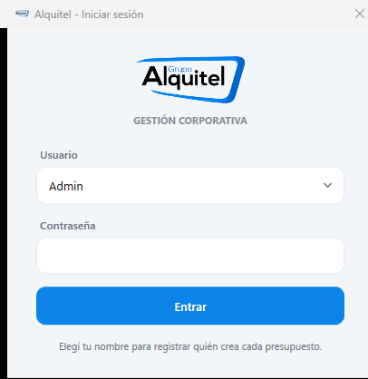

Tiene solamente tres cosas:

1. **Usuario** — una lista desplegable con los nombres del equipo.
2. **Contraseña** — un campo que **aparece solo si el usuario elegido tiene contraseña**.
   Si su nombre no pide contraseña, ese recuadro directamente no se muestra.
3. **Entrar** — el botón azul grande de abajo.

## 2.2 Paso a paso para entrar

1. Haga clic en el recuadro que está debajo de la palabra **Usuario** (el que tiene la
   flechita ▾ a la derecha).
2. Se despliega la lista con los nombres. **Haga clic en su nombre.**
3. Si aparece el recuadro **Contraseña**, haga clic adentro y escriba su clave.
   Por seguridad va a ver puntitos ●●●● en lugar de las letras: es normal.
4. Haga clic en el **botón azul «Entrar»**, o simplemente toque la tecla **Enter**.

> 💡 **Consejo útil:** el programa **recuerda su sesión**. Si ya entró antes en esa
> computadora y no pasó demasiado tiempo, la próxima vez ni siquiera le va a pedir el
> usuario: entra directo al panel de control.

> ⚠️ **Importante:** el usuario que elija queda **registrado en cada presupuesto que
> cree**. En los documentos generados aparecen sus iniciales. Elegir el nombre de otro
> compañero ensucia el historial: entre siempre con el suyo.

## 2.3 Situaciones especiales

**«Me dice que la contraseña es incorrecta.»**
Revise que no tenga activado el **Bloq Mayús** (la luz del teclado). Escriba de nuevo con
calma. Después de varios intentos fallidos el sistema **bloquea ese usuario por unos
minutos** como medida de seguridad y le avisa cuánto falta; simplemente espere ese tiempo.

**«Olvidé mi contraseña.»**
Usted no puede recuperarla solo, y eso es a propósito. Pídale a un **Admin** que entre en
**Configuración → Usuarios y roles**, seleccione su nombre en la lista y use el botón
**«Establecer contraseña al seleccionado»**. Ahí le puede poner una clave nueva.

**«Soy Admin y no tengo contraseña.»**
La primera vez que entre, el sistema le va a **exigir** crear una (los Admin ven datos de
facturación). Escriba la contraseña dos veces y guarde. No se puede saltear este paso.

**«La lista de usuarios aparece vacía o tarda muchísimo.»**
La lista viene del servidor compartido. Si no hay internet, puede demorar o quedar vacía.
Espere unos segundos y, si sigue igual, vea la pregunta 10.1 de este manual.

**«Quiero salir / cambiar de usuario.»**
En el menú de la izquierda, **abajo del todo**, está el botón **«Cerrar sesión»**. Le va
a pedir confirmación y después reabre la pantalla de inicio de sesión.

---

# 3. Recorrido por la pantalla principal

Una vez que entra, ve la pantalla completa del sistema:

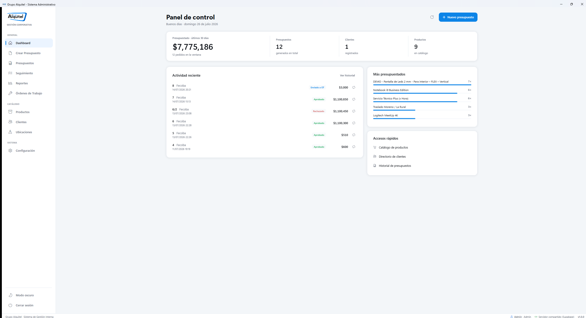

La ventana está dividida en **tres zonas fijas**. Conviene reconocerlas antes de tocar
nada.

## 3.1 🔍 ¿Dónde está esto en la pantalla?

### A · La barra lateral izquierda (el menú)

Es la franja vertical de la izquierda, con el **logo de Alquitel arriba**. Ahí están
todas las secciones del programa, agrupadas en tres títulos chiquitos en gris:

**GENERAL**

| Ícono | Nombre | Para qué sirve | Atajo |
|---|---|---|---|
| 🏠 Casita | **Dashboard** | Pantalla de bienvenida con los números del mes. | `Ctrl+1` |
| 📄 Hoja | **Crear Presupuesto** | El corazón del sistema: armar pedidos y generar documentos. | `Ctrl+2` |
| 📚 Carpeta | **Presupuestos** | Buscador de los documentos Word ya generados. | `Ctrl+6` |
| ☰ Lista | **Seguimiento** | Estado de cada pedido (aprobado, rechazado, facturado…). | `Ctrl+9` |
| 📈 Gráfico | **Reportes** | Facturación y rentabilidad. *Solo Admin.* | `Ctrl+8` |
| 🔧 Llave | **Órdenes de Trabajo** | Los papeles técnicos del depósito. *Admin y Armador.* | — |

**CATÁLOGO**

| Ícono | Nombre | Para qué sirve | Atajo |
|---|---|---|---|
| 📦 Caja | **Productos** | El listado de equipos con precios y stock. | `Ctrl+3` |
| 👥 Personas | **Clientes** | El fichero de empresas. | `Ctrl+4` |
| 📍 Pin | **Ubicaciones** | Los lugares donde se hacen los eventos. | `Ctrl+5` |

**SISTEMA**

| Ícono | Nombre | Para qué sirve | Atajo |
|---|---|---|---|
| ⚙️ Engranaje | **Configuración** | Carpetas, plantillas y usuarios. *Solo Admin.* | `Ctrl+7` |

Abajo del todo, separados por una línea fina:

* **Modo oscuro / Modo claro** — cambia los colores de todo el programa (`Ctrl+T`).
* **Cerrar sesión** — sale del sistema.

> 🔍 **¿Cómo sé en qué sección estoy?** La opción activa queda **resaltada con un fondo
> gris claro** y tiene una **barrita azul vertical pegada a la izquierda**. En la imagen
> de arriba, «Dashboard» está resaltado.

### B · El área grande del centro y la derecha

Es la zona de trabajo: cambia entera cada vez que usted elige una sección del menú.

### C · La barra de estado (la franja gris del fondo)

Ocupa todo el ancho, abajo del todo. De izquierda a derecha muestra:

* El nombre de la empresa.
* 👤 **Su nombre de usuario y su rol** (por ejemplo, «Admin · Admin»).
* Un **puntito de conexión**: **verde** = todo bien con el servidor compartido;
  **rojo** = se cortó internet y el sistema está reintentando.
* El texto **«Servidor compartido (Supabase)»** o **«Base de datos local (SQLite)»**,
  según cómo esté configurado su puesto.
* La **versión** del programa (por ejemplo, `v1.0.0`).

> ⚠️ **Importante:** si ve el puntito **rojo**, sus cambios pueden no estar llegando al
> servidor. Los documentos igual se generan, pero avise al Admin.

## 3.2 El panel de control (Dashboard) por dentro

Volviendo a la [imagen del panel](manual_images/02_pantalla_principal.png), de arriba
hacia abajo hay:

1. **Título «Panel de control»** con un saludo según la hora («Buenos días…») y la fecha
   de hoy escrita en palabras.
2. **Arriba a la derecha:** un botón redondo con una **flecha circular ↻** (recarga los
   números) y el **botón azul «+ Nuevo presupuesto»**, que lo lleva directo a armar un
   pedido.
3. **La franja de números** (una tira blanca ancha con cuatro datos separados por líneas
   finas):
   * **Presupuestado · últimos 30 días** — el número grande. Cuánta plata se presupuestó
     en el último mes.
   * **Presupuestos** — cuántos se generaron en total, desde siempre.
   * **Clientes** — cuántas empresas hay cargadas.
   * **Productos** — cuántos equipos hay en el catálogo.
4. **Actividad reciente** (recuadro grande de la izquierda) — los últimos 6 presupuestos.
   Cada renglón muestra número, cliente, fecha y hora, una **etiqueta de color con el
   estado** y el importe.
   * **Un clic en el renglón** abre ese presupuesto para verlo o editarlo.
   * El **botoncito de la derecha (dos flechas en círculo)** hace *«Repetir pedido»*:
     abre una copia con los mismos productos, pero con fecha y número nuevos y **precios
     actualizados a los de hoy**.
5. **Más presupuestados** (recuadro de arriba a la derecha) — el ranking de los 5 equipos
   más pedidos, con una barrita azul proporcional.
6. **Accesos rápidos** (recuadro de abajo a la derecha) — tres atajos a Productos,
   Clientes e Historial de presupuestos.

> 💡 **Consejo útil:** ¿el panel muestra números viejos? Toque el **botón redondo ↻** de
> arriba a la derecha y se actualizan al instante.

## 3.3 El buscador universal (Ctrl+K)

Si alguna vez no recuerda dónde estaba algo, apriete **Ctrl + K** en cualquier momento.
Se abre una ventanita flotante en el medio de la pantalla:

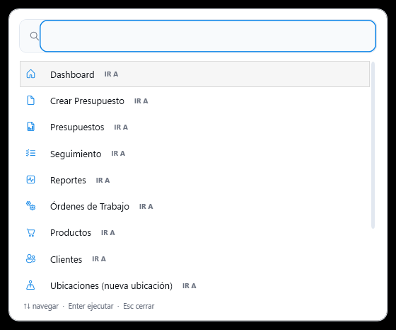

Escriba lo que busca (un nombre de cliente, un producto, un número de presupuesto o el
nombre de una sección) y:

* Use las **flechas ↑ ↓** del teclado para moverse por los resultados.
* Toque **Enter** para ir a lo que eligió.
* Toque **Esc** para cerrarla sin hacer nada.

> 💡 **Consejo útil:** es la forma más rápida de abrir un presupuesto viejo del que solo
> se acuerda el nombre del cliente.

## 3.4 Los avisos que aparecen abajo a la derecha

Cuando el programa termina algo (por ejemplo, generar un documento), aparece un
**cartelito flotante** en la esquina inferior derecha, con un texto y a veces un botón
como **«Abrir carpeta»**. Se va solo a los pocos segundos. Si quiere sacarlo antes, haga
clic en la **✕** de su derecha.

> ⚠️ **Importante:** esos cartelitos **no interrumpen su trabajo**, pero traen información
> valiosa (por ejemplo, dónde se guardó el archivo). Léalos antes de que desaparezcan.

---

# 4. Creación y manejo de presupuestos

Esta es **la pantalla más importante del sistema**. Se llega con `Ctrl+2`, con el botón
**«Crear Presupuesto»** del menú, o con el botón azul **«+ Nuevo presupuesto»** del panel.

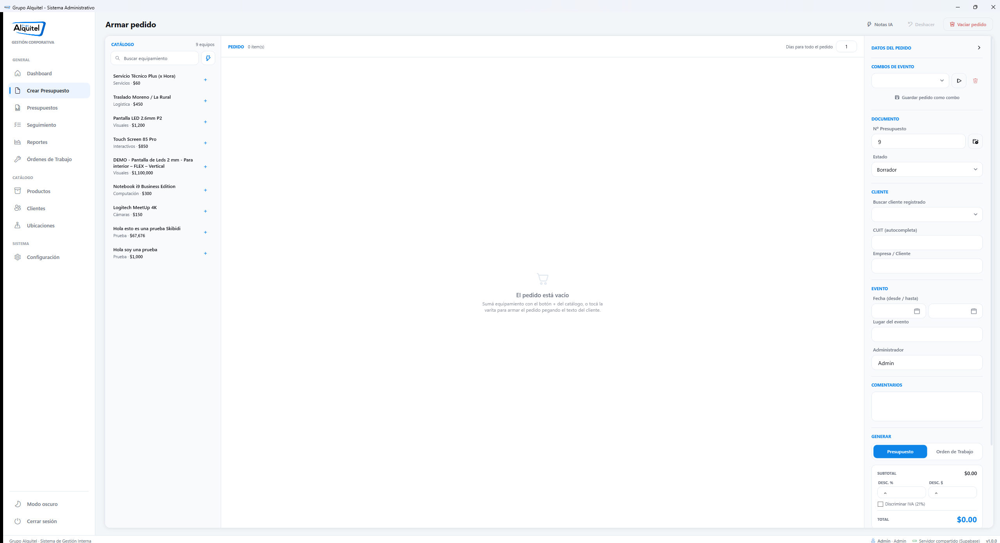

## 4.1 🔍 Las tres columnas de la pantalla

Todo el trabajo pasa dentro de un rectángulo grande dividido en **tres partes verticales**:

| Zona | Ubicación | Qué contiene |
|---|---|---|
| **1 · CATÁLOGO** | Franja angosta de la **izquierda**, con fondo levemente más gris | La lista de todos los equipos disponibles, con su buscador arriba. |
| **2 · PEDIDO** | La **parte del medio**, la más ancha | La planilla con los equipos que usted ya eligió: cantidad, días, medida, precio y subtotal. |
| **3 · DATOS DEL PEDIDO** | Franja de la **derecha** | Cliente, fechas, lugar, comentarios, totales y los botones para **generar los documentos**. |

Arriba de todo dice **«Armar pedido»** y, a la derecha, hay tres botones de apoyo:
**Notas IA**, **Deshacer** y **Vaciar pedido** (este último en rojo).

---

## Paso 1 · Empezar un presupuesto nuevo

Solo tiene que **entrar a la pantalla**. Ya está: al abrirse, el sistema le asigna un
**número de presupuesto nuevo** automáticamente (lo ve en la columna derecha, bajo
**DOCUMENTO → Nº Presupuesto**).

> 💡 **Consejo útil:** ese número se puede cambiar a mano si administración le pidió uno
> en particular. Haga clic en el recuadro y escriba el que corresponda.

> ⚠️ **Importante:** si al entrar aparece un cartel que dice **«Pedido sin guardar»**,
> significa que la última vez quedó un pedido a medio armar (el programa **guarda solo**
> lo que usted va cargando, cada 30 segundos).
> * Si quiere seguir con ese pedido: **«Sí»**.
> * Si era basura de una prueba: **«No»** — y se borra para no volver a molestarlo.

---

## Paso 2 · Elegir el cliente

En la **columna de la derecha**, busque el título gris **CLIENTE**. Hay tres campos, en
este orden:

1. **Buscar cliente registrado** — la lista desplegable. Empiece a escribir el nombre de
   la empresa y el sistema la va autocompletando. Cuando aparezca la correcta, haga clic
   en ella: se completan solos el CUIT y el nombre.
2. **CUIT (autocompleta)** — si prefiere, escriba directamente el CUIT. Apenas ponga los
   11 dígitos correctos, el sistema **busca al cliente y completa el resto solo**.
   Debajo del campo aparece un mensajito:
   * ✓ verde: **«CUIT válido (verificación AFIP)»**.
   * ✗ rojo: el número está completo pero **no pasa la validación** — reviselo.
3. **Empresa / Cliente** — el nombre que va a salir impreso en el documento.

Si el cliente ya existe, aparece además una **«FICHA DEL CLIENTE»**: un recuadro con sus
últimos 3 pedidos, una etiqueta **«Cliente frecuente»** si pidió 3 o más veces en el año,
y sus **notas internas**.

> 💡 **Consejo útil:** ¿el cliente es nuevo y todavía no está cargado? Puede escribir el
> nombre y el CUIT a mano acá mismo y seguir adelante. Después, cuando tenga tiempo,
> cárguelo bien en la sección **Clientes** (capítulo 5) para tener su teléfono y correo.

> ⚠️ **Importante:** las **notas internas** del cliente son solo para el equipo.
> **Nunca** salen impresas en el presupuesto.

---

## Paso 3 · Fechas del evento y lugar

Siempre en la columna derecha, bajo el título gris **EVENTO**:

1. **Fecha (desde / hasta)** — dos recuadros con un **iconito de calendario 📅**.
   * Haga clic en el **calendario del primero** y elija el día en que **arranca** el
     evento. Es obligatorio.
   * El **segundo** es el día en que **termina**. Si el evento dura un solo día, déjelo
     vacío.
   * Si pone una fecha de fin **anterior** a la de inicio, aparece un aviso en rojo
     debajo. Corríjalo antes de seguir.
2. **Lugar del evento** — escriba dónde se hace (por ejemplo, «Predio de La Rural»).
   Mientras escribe, el sistema le sugiere lugares ya usados.
3. **Administrador** — se completa solo con su nombre de usuario. Es quien firma el
   documento.

> 💡 **Consejo útil:** en el documento final la fecha sale escrita en palabras
> («del 14 de abril al 15 de mayo»), así que no se preocupe por el formato.

---

## Paso 4 · Agregar los equipos al pedido

Hay **tres maneras**. Elija la que le resulte más cómoda.

### Manera A · Buscar y tocar el botón «+» (la más simple)

1. En la **columna izquierda (CATÁLOGO)**, haga clic en el recuadro que dice
   **«Buscar equipamiento»** y escriba parte del nombre (por ejemplo, `pantalla`).
2. La lista de abajo se filtra sola.
3. Cuando encuentre el equipo, haga clic en el **botón «+» azul** que está a la
   **derecha del renglón**.
4. El equipo aparece al instante en la planilla del medio, y en el catálogo se muestra
   una **etiqueta azul con la cantidad** («1», «2»…) más un botón **«−»** para sacar
   unidades.

> 💡 **Consejo útil (para ir muy rápido, sin mouse):** escriba en el buscador y toque
> **Enter**: se agrega el primer resultado. Y si necesita varias unidades, escriba la
> cantidad, un asterisco y el nombre: **`3*proyector`** agrega **3 proyectores** de una.

### Manera B · Combos de evento (paquetes ya armados)

Arriba de todo en la columna derecha está **COMBOS DE EVENTO**:

* Elija un combo guardado en la lista desplegable y toque el **botón ▶ (triangulito)**
  de al lado: se cargan todos sus productos de golpe, **con los precios de hoy**.
* El **botón del tacho de basura 🗑** borra el combo elegido (no toca ningún presupuesto
  ya hecho).
* El botón **«Guardar pedido como combo»** hace lo inverso: convierte el pedido que tiene
  armado ahora en un combo reutilizable. Le va a pedir un nombre.

> 💡 **Consejo útil:** si hay eventos que se repiten siempre igual (por ejemplo,
> «Stand feria chico»), guárdelos una vez como combo y después los arma en un clic.

### Manera C · El Asistente de Inteligencia Artificial

Es la función más cómoda cuando el cliente le mandó el pedido por correo o WhatsApp.

**Cómo se abre:** en la columna del catálogo, a la **derecha del buscador**, hay un botón
cuadrado con un ícono de **varita mágica ✨**. Haga clic ahí. Se despliega un panel:

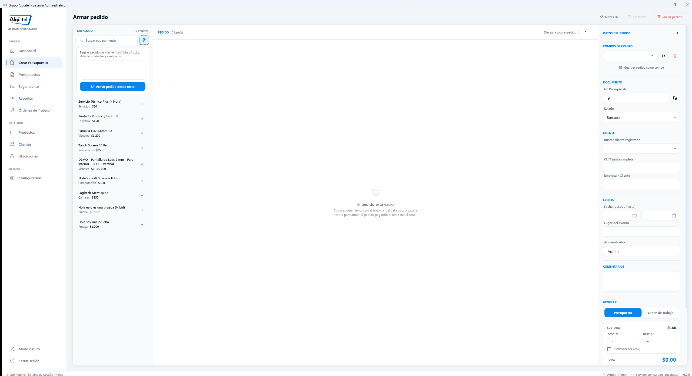

**Cómo se usa, paso a paso:**

1. Copie el texto del cliente (seleccionar con el mouse en el correo → `Ctrl+C`).
2. Haga clic dentro del **cuadro de texto grande** del panel y pegue con `Ctrl+V`.
   Puede pegar el mail entero tal cual está: *«Hola, para el viernes necesitaríamos 2
   pantallas de led y una notebook por 3 días…»*.
3. Haga clic en el botón azul **«Armar pedido desde texto»**.
4. Aparece una barrita de progreso y el texto **«Analizando con IA…»**. Espere unos
   segundos. Si tarda demasiado, hay un botón **«Cancelar análisis»**.
5. El sistema **carga solo** los productos que reconoció, con sus cantidades, y le
   muestra un resumen de lo que hizo.

> ⚠️ **Importante:** el asistente es una **ayuda**, no un reemplazo de su criterio.
> Cuando termina, **revise la planilla del medio**: puede haber confundido un equipo
> parecido o no haber reconocido algo. Corrija cantidades y modelos antes de generar el
> documento.

> 💡 **Consejo útil:** si el pedido ya tenía productos cargados, el sistema le pregunta
> si quiere **reemplazarlos** o **sumarlos** a lo que había.

---

## Paso 5 · Revisar cantidades, precios y totales

### La planilla del medio, columna por columna

| Columna | Qué es | ¿Se puede editar? |
|---|---|---|
| **PRODUCTO** | El nombre del equipo. | No (se cambia en el catálogo). |
| **CANT.** | Cuántas unidades. Tiene los botones **−** y **+** a los costados. | Sí, con los botones. |
| **DÍAS** | Cuántos días se alquila **ese** equipo. | Sí, escribiendo. |
| **MEDIDA** | Medida solicitada, para pantallas y estructuras (ej.: `8 x 3`). | Sí, escribiendo. |
| **P. UNITARIO** | El precio por unidad y por día. Viene del catálogo. | Sí, escribiendo (solo para este presupuesto). |
| **SUBTOTAL** | Cantidad × días × precio. Lo calcula el sistema. | No. |
| **🗑** | Botón rojo que **saca ese renglón** del pedido. | — |

> 💡 **Consejo útil:** si todo el evento dura los mismos días, no cambie renglón por
> renglón. Arriba a la derecha de la planilla hay un campo **«Días para todo el pedido»**:
> escriba ahí el número y se aplica a **todos** los equipos de una vez.

> ⚠️ **Importante:** si al lado del nombre de un equipo aparece un **triangulito amarillo
> de advertencia ⚠**, significa que **no hay stock suficiente** para esa fecha: ese equipo
> ya está comprometido en otras órdenes. Pase el mouse por encima para ver el detalle.
> El sistema **le deja generar igual**, pero conviene confirmarlo con el depósito.

### El bloque de totales (columna derecha, abajo)

Bajo el título **GENERAR** hay un recuadro con las cuentas:

* **SUBTOTAL** — la suma de todos los renglones.
* **DESC. %** — descuento en porcentaje sobre el subtotal. Escriba solo el número
  (por ejemplo, `10` para diez por ciento).
* **DESC. $** — descuento en pesos, un monto fijo. **Se suma** al porcentual.
* **DESCUENTO** — cuánto se está descontando en total, en rojo y con el signo −.
  Solo aparece si cargó algún descuento.
* **☐ Discriminar IVA (21%)** — la casilla:
  * **Tildada:** los precios que cargó son **netos** y el documento le suma el IVA aparte.
  * **Destildada:** los precios que cargó **ya son finales**.
* **TOTAL** — el número grande en azul. Es lo que va a pagar el cliente.

> ⚠️ **Importante:** antes de generar, **mire siempre el TOTAL**. Es el número que va a
> leer el cliente.

### El recuadro amarillo de avisos

Justo arriba de los botones puede aparecer un **recuadro amarillo** con avisos como:

* ⚠ *La fecha del evento ya pasó.*
* ⚠ *Falta el lugar del evento.*
* ⚠ *El cliente no tiene CUIT cargado.*
* ⚠ *N producto(s) con posible conflicto de stock.*

> 💡 **Consejo útil:** esos avisos **no le impiden** generar el documento. Son una segunda
> mirada para que no tenga que rehacer el presupuesto después.

### El botón «Notas IA» (arriba a la derecha)

Escribe automáticamente una **nota técnica corta** para cada equipo que no tenga una.
Esas notas salen en la **Orden de Trabajo** y ayudan al armador.
**Reviselas siempre antes de generar la OT.**

### El botón «Deshacer» (o Ctrl+Z)

Si borró un equipo o vació el pedido por error, **«Deshacer»** vuelve atrás el último
cambio de productos. Guarda los últimos 20 pasos.

---

## Paso 6 · Guardar, generar el documento y enviarlo

### 6.1 Elegir qué documento va a generar

En el bloque **GENERAR**, arriba de todo, hay un interruptor de dos posiciones:

* **Presupuesto** (comercial) — muestra precios y totales. Es lo que ve el cliente.
* **Orden de Trabajo** (técnico) — **oculta todos los precios** de la pantalla y prepara
  el papel del depósito.

El botón que esté activo se pinta de **azul**.

### 6.2 Los tres botones de generación

| Botón | Color | Qué genera | Para quién |
|---|---|---|---|
| **Generar Presupuesto** | Azul, grande | El presupuesto comercial en Word. | El cliente. |
| **Generar O. Facturación** | Gris | La Orden de Facturación (OF). | Administración. |
| **Generar O. Trabajo** | Gris (se pone **verde** en la vista técnica) | La Orden de Trabajo (OT). | Depósito y montaje. |

**Qué pasa cuando toca uno:**

1. El sistema **revisa los datos obligatorios**. Si falta algo, aparece un cartel
   **«Datos incompletos»** con la lista exacta de lo que hay que completar
   (cliente, número, fecha, días, y al menos un producto).
2. Si hay conflicto de stock, le pregunta si quiere seguir igual.
3. Se abre Word **en segundo plano** (usted no lo ve) y arma el documento con la
   plantilla de la empresa. Puede tardar unos segundos: **es normal, no toque nada**.
4. Al terminar aparece el cartelito verde abajo a la derecha:
   **«Documento guardado: …»** con un botón **«Abrir carpeta»**.
5. El pedido queda **guardado en la base de datos** con su número y estado.

> ⚠️ **Importante:** el nombre del archivo se arma solo, con este formato:
> `31294- 0726- FECOBA- LA RURAL- AA.docx`
> (número · fecha · cliente · lugar · iniciales de quien lo hizo). **No lo renombre a
> mano**: la pantalla «Presupuestos» lee esos datos del nombre del archivo.

> 💡 **Consejo útil:** si en Configuración está tildada la opción de PDF, además del
> `.docx` se genera un `.pdf` en la misma carpeta, sin que usted haga nada.

### 6.3 El estado del presupuesto

En la columna derecha, bajo **DOCUMENTO**, hay una lista **Estado** con estas opciones:

| Estado | Qué significa |
|---|---|
| **Borrador** | Recién hecho, todavía no lo aprobó nadie. |
| **Aprobado** | El cliente lo aceptó. |
| **Facturación (OF)** | Pasó a administración para facturar. |
| **Orden de Trabajo** | Pasó al depósito para armar los equipos. |
| **Rechazado** | El cliente lo rechazó. |
| **Archivado** | Ya no está en circulación. |

### 6.4 Enviar por correo

El botón **«Enviar por mail»** (con un ícono de sobre ✉) **abre un borrador de Outlook**
con el último documento generado ya adjuntado (y su PDF, si se exportó).

> ⚠️ **Importante:** el sistema **no manda nada solo**. Le deja el correo escrito y
> abierto: usted revisa el destinatario y el texto, y recién ahí toca «Enviar» en Outlook.

### 6.5 Crear una nueva versión de un presupuesto

Si el cliente pide cambios y usted quiere **conservar la versión anterior**, use el
botoncito que está **a la derecha del Nº de Presupuesto** (ícono de dos hojas).

Se abre una ventana **«Nueva versión de presupuesto»** que muestra arriba
`31294 → 31294/2`, con la lista de ítems. Ahí puede:

* **Destildar** los ítems que no van en la versión nueva.
* Cambiar cantidad, días y precio de cada uno.
* **Agregar productos** del catálogo con el buscador de arriba y el botón verde
  «Agregar producto».
* Ver el **Total** actualizado abajo a la izquierda.

Finalmente toque el botón azul **«Crear versión 31294/2 y editar»**.

> 💡 **Consejo útil:** la versión anterior **queda intacta**. Es la forma correcta de
> manejar «el cliente pidió otra cosa» sin perder el historial.

---

## Paso 7 · El Portal de Aprobación (que el cliente apruebe desde el navegador)

En vez de esperar un mail de respuesta, puede mandarle al cliente un **link** para que
apruebe o rechace el presupuesto con un clic.

**Cómo se hace:**

1. Genere primero el presupuesto (el link necesita que el pedido esté guardado).
2. En la columna derecha, abajo del todo, toque **«Link de aprobación»** (ícono de
   cadenita 🔗).
3. El sistema crea el link y lo **copia al portapapeles** automáticamente.
4. Péguelo (`Ctrl+V`) en el correo al cliente —por ejemplo, en el borrador que abre el
   botón «Enviar por mail»—.

**Qué ve el cliente:** una página web con el presupuesto completo (empresa, CUIT, fechas,
lugar, equipos con sus descripciones y el desglose de totales) y dos botones grandes:
**Aprobar** y **Rechazar**, con confirmación en dos pasos para evitar clics accidentales.

**Qué pasa cuando responde:** el estado del presupuesto **cambia solo** en el sistema
(pasa a *Aprobado* o *Rechazado*) y queda registrada la fecha y la hora. Usted lo ve al
recargar la pantalla **Seguimiento**.

> ⚠️ **Importante:** ese link es **secreto y sirve una sola vez**. No lo publique ni lo
> reenvíe a terceros. El cliente **nunca** ve datos internos: ni costos, ni notas
> internas, ni descuentos especiales acordados.

---

# 5. Gestión de clientes

Se entra con **`Ctrl+4`** o con **«Clientes»** en el menú de la izquierda.

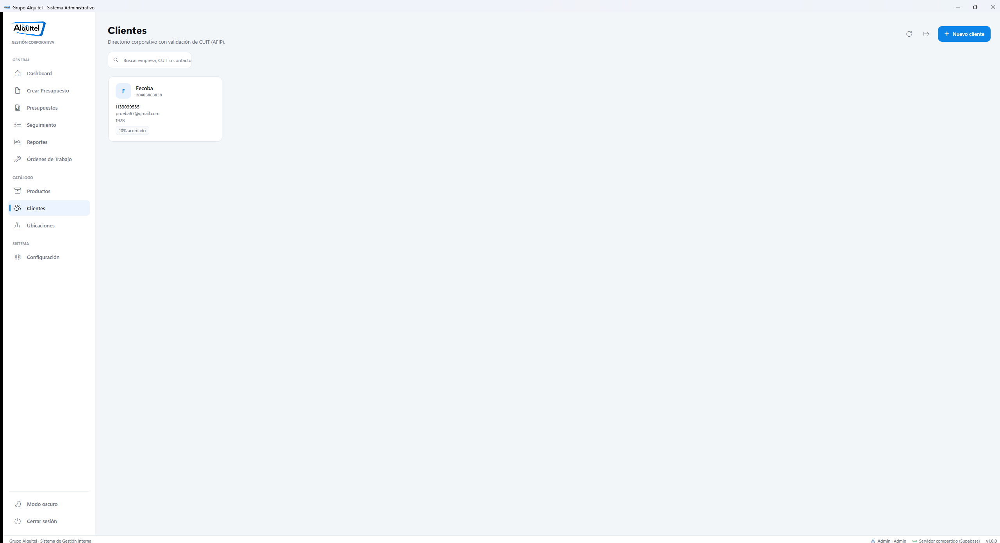

## 5.1 Ver y buscar clientes

La pantalla muestra el directorio como una **grilla de fichas**. Cada ficha tiene:

* Un **cuadradito celeste con las iniciales** de la empresa.
* El **nombre** de la empresa y su **CUIT** debajo.
* El nombre del **contacto**, el **correo** y el **teléfono** (solo si están cargados).
* Una **etiqueta** del tipo «10 % acordado» si ese cliente tiene un descuento pactado.

**Para buscar:** haga clic en el recuadro ancho de arriba a la izquierda que dice
**«Buscar empresa, CUIT o contacto»** y escriba. La grilla se filtra sola, sin apretar
ningún botón.

**Los botones de arriba a la derecha:**

* **↻ (flecha circular)** — recarga el directorio.
* **📄 (hoja con flecha)** — **exporta a CSV**, un archivo que se abre con Excel.
* **«+ Nuevo cliente»** (botón azul) — crea uno nuevo.

## 5.2 Cargar un cliente nuevo

Haga clic en el **botón azul «+ Nuevo cliente»** (arriba a la derecha). El directorio se
oscurece y **se abre un panel a la derecha**, como un cajón:

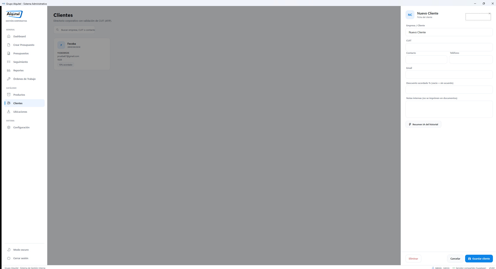

Complete los campos, de arriba hacia abajo:

| Campo | Qué poner | ¿Obligatorio? |
|---|---|---|
| **Empresa / Cliente** | La razón social, tal cual va a salir en el documento. | **Sí** |
| **CUIT** | Los 11 números. Puede escribirlo con o sin guiones. | Recomendado |
| **Contacto** | El nombre de la persona con la que habla. | No |
| **Teléfono** | Teléfono directo o celular. | No |
| **Email** | El correo al que se le mandan los presupuestos. | No |
| **Descuento acordado %** | Solo si tiene un precio especial pactado. Escriba el número (ej.: `10`). Vacío = sin acuerdo. | No |
| **Notas internas** | Condiciones de pago, cómo trata, con quién hablar. | No |

Debajo del CUIT aparece la validación en vivo:
✓ verde **«CUIT válido»** o ✗ rojo si el número no pasa la verificación.

Para terminar, use los botones del **pie del panel**:

* **«Guardar cliente»** (azul, abajo a la derecha) — guarda y cierra.
* **«Cancelar»** (gris) — cierra sin guardar.
* **«Eliminar»** (rojo, abajo a la izquierda) — borra el cliente.

> 💡 **Consejo útil:** también puede cerrar el panel sin guardar haciendo clic en la zona
> **oscurecida** de la izquierda, o en la **✕** de arriba a la derecha del panel.

> ⚠️ **Importante:** las **notas internas** son de uso interno y **jamás** se imprimen en
> un presupuesto ni las ve el cliente.

## 5.3 Modificar un cliente existente

Haga **un clic** sobre la ficha del cliente en la grilla. Se abre el mismo panel, ya
completo con sus datos. Cambie lo que necesite y toque **«Guardar cliente»**.

## 5.4 El resumen con Inteligencia Artificial

Dentro de la ficha, más abajo, hay un botón **«Resumen IA del historial»** (con la varita
mágica ✨). Al tocarlo, el sistema lee todos los pedidos de ese cliente y escribe un
párrafo contando **qué alquila, cada cuánto y por qué montos**.

> 💡 **Consejo útil:** es muy práctico antes de una reunión: en dos renglones se entera
> de todo el historial comercial del cliente.

## 5.5 Eliminar un cliente

Use el botón rojo **«Eliminar»** del pie del panel. El sistema pide confirmación.

> ⚠️ **Importante:** eliminar un cliente **no borra sus presupuestos históricos**. El
> cliente se archiva: deja de aparecer en las listas, pero los documentos y el historial
> quedan intactos.

---

# 6. Catálogo de productos e inventario

Se entra con **`Ctrl+3`** o con **«Productos»** en el menú.

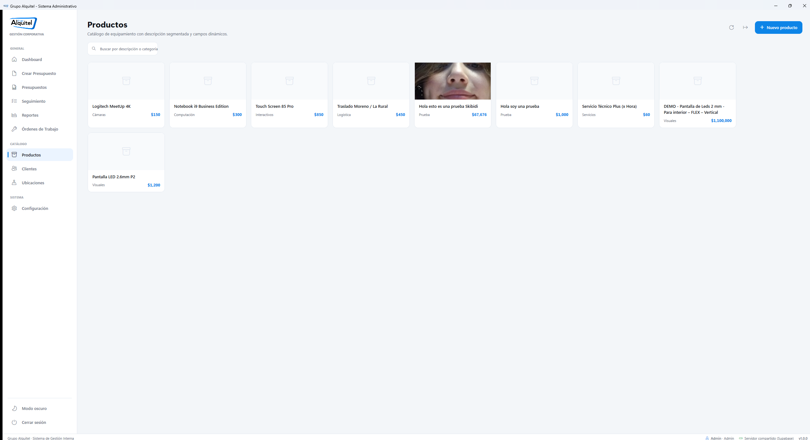

## 6.1 Ver el catálogo

Los equipos se muestran como una **vidriera de fichas**. Cada una tiene:

* La **foto del equipo** arriba (si no tiene foto cargada, se ve un ícono gris de caja).
* La **descripción** del equipo.
* La **categoría** abajo a la izquierda (Visuales, Sonido, Computación, Servicios…).
* El **precio** abajo a la derecha, en azul.

**Para buscar:** use el recuadro **«Buscar por descripción o categoría»** de arriba a la
izquierda. Escriba `sonido`, `pantalla`, `notebook` — lo que sea — y la vidriera se
filtra sola.

**Botones de arriba a la derecha:** **↻** recarga, **📄** exporta el catálogo a CSV
(Excel) y **«+ Nuevo producto»** (azul) crea uno nuevo.

## 6.2 Crear o editar un producto: el «Taller»

Haga clic en **«+ Nuevo producto»**, o **un clic** sobre la ficha de un producto que ya
exista. La vidriera desaparece y se abre el **Taller de producto**:

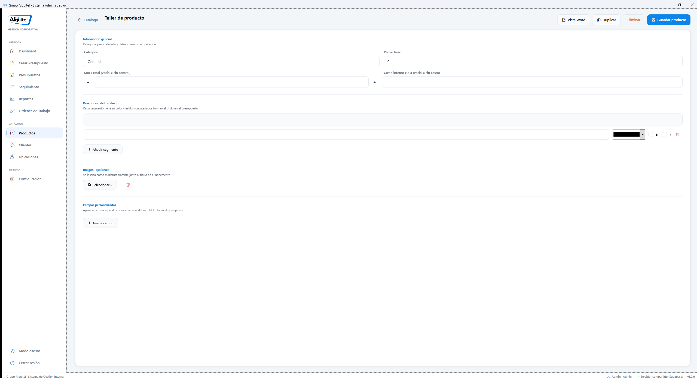

La pantalla se divide en dos:

* **Izquierda:** el formulario, con sus secciones separadas por líneas finas.
* **Derecha:** la **vista previa en papel**, que muestra **cómo va a quedar ese producto
  impreso en el presupuesto de Word**. Se actualiza mientras usted escribe.

### Barra de arriba del Taller

| Botón | Qué hace |
|---|---|
| **← Catálogo** | Vuelve a la vidriera **sin guardar** los cambios. |
| **Vista Word** | Muestra u oculta la hoja de vista previa de la derecha. |
| **Duplicar** | Crea una copia de este producto (ideal para variantes). |
| **Eliminar** (rojo) | Archiva el producto. |
| **Guardar producto** (azul) | Guarda los cambios. |

### Sección «Información general»

| Campo | Qué poner |
|---|---|
| **Categoría** | El grupo al que pertenece (Visuales, Sonido, Logística…). |
| **Precio base** | Precio por unidad y **por día**. Solo el número. |
| **Stock total** | Cuántas unidades físicas tiene la empresa. **Déjelo vacío** para servicios o cosas sin control de stock. Tiene botones **−** y **+**. |
| **Costo interno x día** | Lo que le cuesta a la empresa. **Nunca se imprime**: se usa solo en Reportes para calcular el margen. |

> ⚠️ **Importante:** el **costo interno** es información sensible. No aparece en ningún
> documento que vea el cliente, pero sí en la pantalla de Reportes (que solo ven los
> Admin).

### Sección «Disponibilidad de stock»

Si el producto tiene stock cargado, aparece esta sección con **cuadraditos por fecha**
que muestran cuántas unidades quedan libres cada día:

* Borde **verde** = hay de sobra.
* Borde **amarillo** = queda justo.
* Borde **rojo** con fondo rosado = **está sobrevendido** para ese día.

Debajo se listan las **órdenes activas** que están usando ese equipo, con su número,
cliente, fechas y cantidad.

### Sección «Descripción del producto»

Acá se arma el **título** que sale impreso, y se arma **por partes** («segmentos») para
poder darle color y estilo a cada parte.

Cada renglón de segmento tiene:

1. El **texto** de esa parte.
2. Un **selector de color** (el rectangulito de color: haga clic y elija).
3. La casilla **N** = negrita.
4. La casilla **I** = cursiva.
5. Un **tacho rojo 🗑** para borrar ese segmento.

Arriba de todo hay una **vista previa en vivo** que muestra los segmentos concatenados,
tal como se van a ver.

Con el botón **«+ Añadir segmento»** se agregan más partes.

> 💡 **Consejo útil:** ejemplo típico — segmento 1: `Pantalla LED 2.6mm` en negro y
> negrita; segmento 2: ` — Para interior` en gris. El resultado impreso es un título con
> dos estilos distintos.

### Sección «Imagen (opcional)»

El botón **«Seleccionar…»** abre el explorador de Windows para elegir la foto del equipo.
La foto se inserta como **miniatura al lado del título** en el documento de Word.
El **tacho rojo** de al lado quita la imagen.

### Sección «Campos personalizados»

Son las **especificaciones técnicas** que salen debajo del título en el presupuesto.
Cada renglón tiene: **Etiqueta** (ej.: `Resolución`), **Valor** (ej.: `1920x1080`),
las casillas **N** (negrita) y **S** (subrayado), el **color** y el tacho para borrar.

Se agregan con **«+ Añadir campo»**.

> 💡 **Consejo útil:** haga clic sobre la **hoja de vista previa de la derecha** para
> verla **en tamaño grande**. Se cierra con el botón «Cerrar» o haciendo clic afuera.

---

# 7. Órdenes de trabajo y seguimiento

## 7.1 ¿Qué es una Orden de Trabajo?

Un **presupuesto** es un documento **comercial**: dice cuánto sale.
Una **Orden de Trabajo (OT)** es un documento **técnico**: dice **qué equipos hay que
preparar, cuántos, para qué fecha y para qué lugar** — y **no lleva precios**, porque el
depósito no necesita verlos.

## 7.2 Cómo pasar un presupuesto aprobado a Orden de Trabajo

1. Abra el presupuesto (desde el panel de control, desde Seguimiento o con `Ctrl+K`).
2. En la columna derecha, bloque **GENERAR**, toque el interruptor
   **«Orden de Trabajo»**: los precios desaparecen de la pantalla y el botón
   **«Generar O. Trabajo»** se pone **verde y grande**.
3. *(Opcional pero recomendado)* toque **«Notas IA»** arriba a la derecha para que cada
   equipo tenga su nota técnica, y **reviselas**.
4. Escriba, si hace falta, indicaciones en el bloque **COMENTARIOS** de la columna
   derecha: eso sale en la sección de comentarios de la OT.
5. Toque **«Generar O. Trabajo»**.
6. Cambie el **Estado** del presupuesto a **«Orden de Trabajo»**.

## 7.3 La pantalla «Órdenes de Trabajo»

Está en el menú de la izquierda (la ven los **Admin** y los **Armadores**).

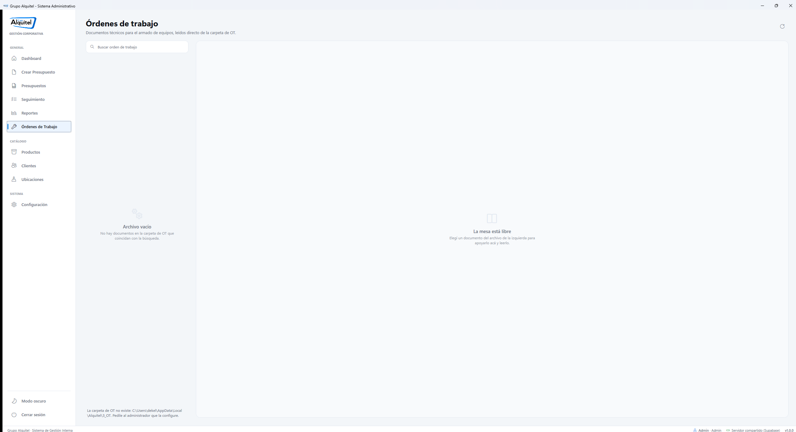

*(En la imagen el archivo aparece vacío porque en esa computadora todavía no está
configurada la carpeta de OT. Cuando hay documentos, se listan en la columna izquierda.
Si a usted le aparece el mensaje «La carpeta de OT no existe…», avísele al Admin: se
arregla en **Configuración → Documentos**.)*

Está pensada como una **mesa de lectura**:

* **A la izquierda**, el archivo de documentos de OT, con un buscador arriba
  («Buscar orden de trabajo»). Cada renglón muestra el nombre del archivo y la fecha en
  que se modificó.
* **A la derecha**, el documento elegido, mostrado como una **hoja blanca** para leerlo
  sin abrir Word.
* Arriba de la hoja hay dos botones: **«Abrir en Word»** (azul) y **«Eliminar»** (rojo).

> 💡 **Consejo útil:** para el depósito, esta pantalla alcanza: se busca el evento, se lee
> el papel en la hoja de la derecha y se arma. No hace falta abrir Word.

## 7.4 La pantalla «Seguimiento»: el estado de todos los pedidos

Se entra con **`Ctrl+9`** o con **«Seguimiento»** en el menú.

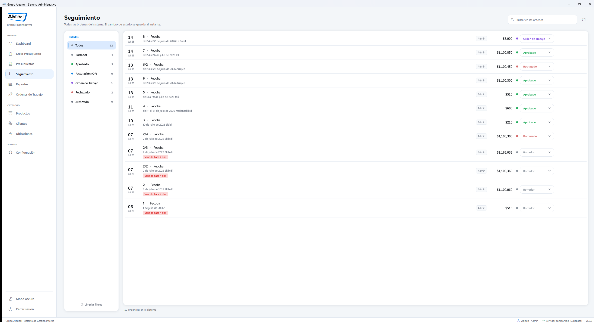

Es el **libro mayor** del negocio: todas las órdenes del sistema, una debajo de la otra.

**A la izquierda — el rail de Estados.** Una lista con un **puntito de color** por estado
y el **número de órdenes** que hay en cada uno. Haga clic en un estado para ver solo esas
órdenes. Abajo, el botón **«Limpiar filtros»** vuelve a mostrar todo.

**A la derecha — el registro.** Cada renglón muestra:

* **El día y el mes**, a la izquierda del todo, en grande.
* El **número de presupuesto** y el **cliente**.
* Debajo, la **fecha del evento** y el **lugar**.
* Una **etiqueta gris** con el nombre de quien lo creó.
* El **total** en pesos.
* Una **lista desplegable con el estado**, editable directamente ahí.

> ⚠️ **Importante:** cuando cambia el estado en esa lista, **se guarda al instante** en la
> base de datos. No hay botón «Guardar» y **no se puede deshacer** con Ctrl+Z: elija bien.

**Botones que aparecen al pasar el mouse por un renglón** (a la derecha del todo):

| Ícono | Qué hace |
|---|---|
| 👁 Ojo / hoja | **Abre** ese presupuesto en el armador. |
| 🔄 Dos flechas | **Repetir pedido**: copia con precios de hoy y fechas nuevas. |
| 🕐 Reloj | **Historial**: quién lo generó, quién lo editó y quién cambió el estado, con fecha y hora. |

**Etiquetas de vigencia:** si un presupuesto está **por vencer** aparece una etiqueta
amarilla, y si **ya venció**, una roja. Solo aparecen cuando corresponde.

**Buscador:** arriba a la derecha hay un campo **«Buscar en las órdenes»** que filtra por
número, cliente, lugar o creador.

## 7.5 La pantalla «Presupuestos»: los archivos ya generados

Se entra con **`Ctrl+6`**. Es distinta de «Seguimiento»: acá no se ven **órdenes de la
base de datos**, sino los **archivos .docx que están en la carpeta**.

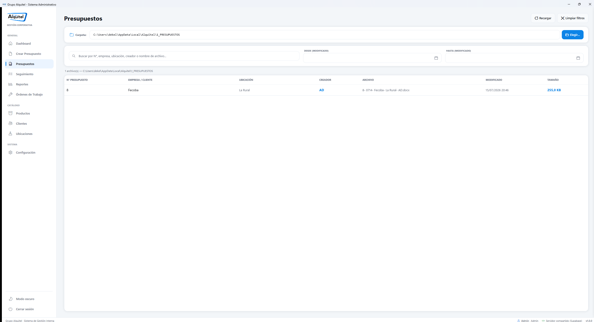

De arriba hacia abajo:

1. **Carpeta** — la ruta donde se guardan los presupuestos, con el botón **«Elegir...»**
   para cambiarla.
2. **Filtros** — un buscador («Buscar por N°, empresa, ubicación, creador o nombre de
   archivo…») y dos calendarios **DESDE** y **HASTA** por fecha de modificación.
3. **La grilla** — una fila por archivo, con las columnas: N° PRESUPUESTO, EMPRESA /
   CLIENTE, UBICACIÓN, CREADOR, ARCHIVO, MODIFICADO y TAMAÑO.

**Haga un clic** en una fila y se abre un **panel a la derecha** con el detalle del
archivo y estos botones:

| Botón | Qué hace |
|---|---|
| **Abrir archivo** (azul) | Abre el documento en Word. |
| **Crear nueva versión** | Abre el editor de versiones (`31294 → 31294/2`). |
| **Repetir pedido** | Abre el armador con una copia, con precios de hoy. |
| **Mostrar en el Explorador** | Abre la carpeta de Windows con el archivo señalado. |
| **Eliminar archivo** (rojo) | **Borra el .docx del disco.** |

> ⚠️ **Importante:** «Eliminar archivo» borra el documento **del disco**. La orden sigue
> existiendo en la base de datos, pero el Word desaparece. Úselo solo para limpiar
> pruebas.

> 💡 **Consejo útil:** también puede hacer **doble clic** sobre una fila para abrir el
> documento directamente.

## 7.6 Ubicaciones (los lugares de los eventos)

Se entra con **`Ctrl+5`**. Es el **padrón de lugares**: predios, salones y hoteles donde
se montan los eventos.

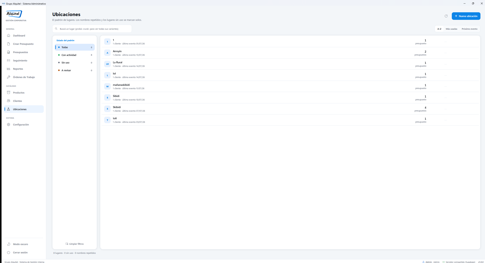

Sirve para que el mismo lugar no quede escrito de cinco maneras distintas
(«La Rural», «la rural», «Predio La Rural»…).

* **Buscador** arriba: pruebe escribir parte del nombre para ver todas sus variantes.
* **Orden**: botones **A–Z**, **Más usadas** y **Próximo evento**.
* **Estado del padrón** (rail izquierdo): filtra por lo que hay que revisar —
  nombres repetidos, lugares sin nombre, lugares sin uso.
* Al pasar el mouse por un renglón aparecen botones para **renombrar**, **ver sus
  presupuestos**, **fusionar con otro lugar** y **eliminar**.

**Fusionar** sirve cuando el mismo lugar quedó cargado dos veces: elige uno, elige con
cuál unirlo, y **todos sus presupuestos pasan al que eligió**.

> ⚠️ **Importante:** la fusión **no se puede deshacer**. Y renombrar un lugar **no
> reescribe los .docx ya generados**: los archivos viejos van a seguir mostrando el nombre
> anterior.

---

# 8. Reportes y resúmenes

*Esta sección solo la ven los usuarios **Admin**.* Se entra con **`Ctrl+8`**.

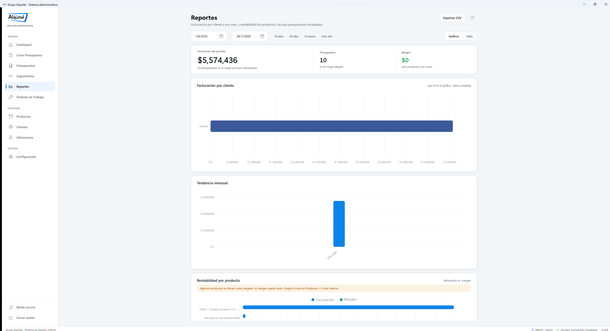

## 8.1 Elegir el período

Arriba de todo hay **dos calendarios** (desde y hasta) y cuatro botones rápidos:
**«30 días»**, **«90 días»**, **«12 meses»** y **«Este año»**. Tocar uno de esos botones
es más rápido que elegir fechas a mano.

## 8.2 Gráficos o tabla

A la derecha de los calendarios hay un interruptor **«Gráficos | Tabla»**:

* **Gráficos** — muestra la información con barras de colores.
* **Tabla** — muestra los mismos datos como una planilla con números exactos.

## 8.3 Los números de arriba

Una franja con tres datos:

* **Facturación del período** — el número grande.
* **Presupuestos** — cuántos hubo en el rango elegido.
* **Margen** — en verde, la ganancia estimada. **Solo cuenta los productos que tienen
  cargado su costo interno.**

## 8.4 Las tres secciones de análisis

1. **Facturación por cliente** — quién le compró más. El gráfico muestra el top 10; la
   tabla, la lista completa.
2. **Tendencia mensual** — cómo evolucionó la facturación mes a mes.
3. **Rentabilidad por producto** — qué equipos dejan más ganancia. Columnas: producto,
   veces presupuestado, facturación, costo y **margen**.

> ⚠️ **Importante:** si aparece un recuadro amarillo que dice que *«algunos productos no
> tienen costo cargado»*, el margen de esos equipos queda vacío y el total es incompleto.
> Se soluciona cargando el **Costo interno x día** en el Taller de productos (capítulo 6).

> 💡 **Consejo útil:** los reportes **excluyen automáticamente los presupuestos
> rechazados**, así que los números no están inflados.

## 8.5 Exportar a Excel

El botón **«Exportar CSV»** (arriba a la derecha) guarda todo el reporte en un archivo
que se abre con Excel, para seguir trabajándolo o mandarlo al contador.

## 8.6 El resumen semanal automático

Todos los lunes (más precisamente, **la primera vez que alguien entra al sistema cada
semana**) Alquitel genera **solo** un documento de Word con el resumen de la semana
anterior. Aparece un cartelito abajo a la derecha que dice **«Resumen semanal listo»**
con un botón **«Abrir»**.

> 💡 **Consejo útil:** si dejó pasar el cartelito, el archivo está guardado igual, en la
> carpeta `Resumenes` dentro de los datos de la aplicación. Pídale la ruta al Admin.

---

# 9. Ajustes y copias de seguridad

## 9.1 Cambiar entre modo claro y modo oscuro

Esto lo puede hacer **cualquier usuario**, en cualquier momento:

* **Con el mouse:** abajo del todo en el menú de la izquierda, haga clic en
  **«Modo oscuro»** (o **«Modo claro»**, según cómo esté ahora).
* **Con el teclado:** apriete **`Ctrl + T`**.

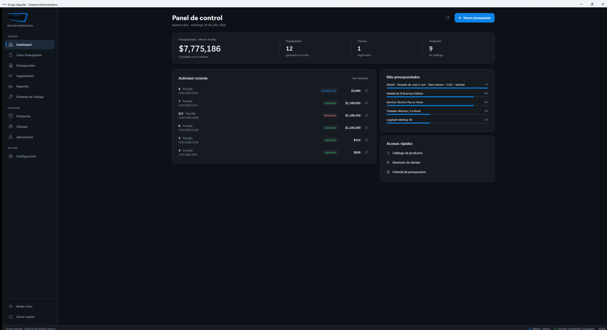

El cambio es inmediato y **el programa lo recuerda** para la próxima vez que entre.

> 💡 **Consejo útil:** el **modo claro** se lee mejor en oficinas con mucha luz o ventanas
> a la espalda. El **modo oscuro** cansa menos la vista de noche.

## 9.2 La pantalla de Configuración

*Solo la ven los **Admin**.* Se entra con **`Ctrl+7`**.

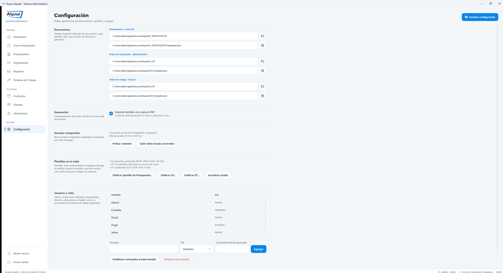

Está organizada en franjas: a la **izquierda** el nombre y la explicación de cada cosa,
y a la **derecha** los controles.

> ⚠️ **Importante:** cualquier cambio que haga acá **hay que confirmarlo con el botón azul
> «Guardar configuración»**, arriba a la derecha. Si sale de la pantalla sin guardar, se
> pierde.

### A · Documentos (carpetas y plantillas)

Para cada uno de los tres tipos de documento — **Presupuestos**, **Orden de facturación
(OF)** y **Orden de trabajo (OT)** — hay dos renglones:

1. La **carpeta** donde se guardan los archivos generados (botón con ícono de 📁 para
   elegirla).
2. La **plantilla .docx** que se usa como base (botón con ícono de 📄).

### B · Generación

Una sola casilla: **«Exportar también una copia en PDF»**. Si la tilda, cada vez que se
genere un documento se crea además un `.pdf` al lado del `.docx`.

### C · Servidor compartido

Muestra el estado de la conexión con la base compartida. Tiene dos botones:

* **«Probar conexión»** — verifica que el servidor responda.
* **«Subir datos locales al servidor»** — **carga inicial**: sube todo lo que hay en la
  base local de esa máquina al servidor.

> ⚠️ **Importante:** «Subir datos locales al servidor» se ejecuta **una sola vez**, desde
> la computadora que tiene el histórico. Si lo corre en otra máquina puede duplicar datos.
> Ante la duda, **no lo toque**.

### D · Copias de seguridad

*(Aparece solo si el puesto trabaja con base local.)*

Alquitel **hace copias solo, cada 6 horas**, y conserva **las últimas 20**. Usted no
tiene que hacer nada para que existan.

Para restaurar una:

1. Elija la copia que quiere en la lista (están ordenadas por fecha).
2. Toque **«Restaurar seleccionado»**.
3. La base actual **no se pierde**: se guarda aparte con el nombre `Alquitel_PreRestore_*`.

El botón **«Actualizar lista»** vuelve a leer las copias disponibles.

> ⚠️ **Importante:** restaurar una copia **devuelve el sistema al estado de esa fecha**.
> Todo lo cargado después se pierde. Úselo solo ante un problema serio, y avise al equipo
> antes de hacerlo.

### E · Plantillas en la nube

Permite publicar las plantillas `.docx` en el servidor para que **todos los puestos usen
la misma versión**. Hay un botón por tipo: **«Publicar plantilla de Presupuesto…»**,
**«Publicar OF…»**, **«Publicar OT…»** y **«Actualizar estado»**.

> 💡 **Consejo útil:** cuando cambie el diseño del presupuesto, publique la plantilla una
> vez desde acá en lugar de copiar el archivo puesto por puesto.

### F · Usuarios y roles

Una tabla con el **nombre** y el **rol** de cada persona del equipo. Debajo:

**Para dar de alta a alguien:** escriba el **Nombre**, elija el **Rol**
(Vendedor / Admin / Armador), opcionalmente una **contraseña inicial**, y toque
**«Agregar»**.

**Para el usuario seleccionado en la tabla:**

* **«Establecer contraseña al seleccionado»** — le pone una clave nueva (o se la quita).
* **«Eliminar seleccionado»** — lo da de baja.
* **«Modificar nombre» / «Modificar rol»** + **«Guardar cambios»** — corrige sus datos.

Al seleccionar a alguien también aparece un recuadro informativo con su actividad.

> ⚠️ **Importante:** cambiarle el rol a alguien cambia **qué pantallas puede ver**. Pasar
> a un Vendedor a Armador le deja **solo** las Órdenes de Trabajo.

---

# 10. Preguntas frecuentes: «¿Qué hago si…?»

### 10.1 «Abro el programa y la pantalla queda en blanco o tarda muchísimo»

1. **Espere 30 segundos.** Al arrancar, el programa se conecta al servidor compartido y
   eso puede tardar si la conexión está lenta.
2. Mire la **barra gris de abajo**: si el puntito está **rojo**, es un problema de
   internet, no del programa.
3. Cierre Alquitel (la **✕** de arriba a la derecha) y vuelva a abrirlo.
4. Si sigue igual, revise que la computadora tenga internet abriendo cualquier página web.
5. Si nada funciona, avise al Admin: los archivos de registro (`logs`) le van a decir qué
   pasó.

### 10.2 «Le doy a Generar y no pasa nada / dice “Datos incompletos”»

Aparece un cartel con **la lista exacta** de lo que falta. Los cinco motivos habituales:

* Falta el nombre en **Empresa / Cliente**.
* Falta el **Nº de Presupuesto**.
* Falta la **fecha del evento**.
* El pedido **no tiene ningún producto**.
* El **CUIT** cargado no es válido.

Complete lo que le indica el cartel y vuelva a tocar el botón.

### 10.3 «Dice “Error de Plantilla” o “No hay plantilla disponible”»

El sistema no encuentra el archivo de Word que usa como base. **Usted no puede
resolverlo desde su pantalla.** Avise a un **Admin**: tiene que ir a
**Configuración → Documentos** y volver a indicar la ruta de la plantilla, o publicarla
desde **Plantillas en la nube**.

### 10.4 «El documento salió con el número de presupuesto equivocado»

Pasa cuando **dos personas generan al mismo tiempo** y el número se ocupó. El sistema le
avisa con un cartel: *«Número de presupuesto renumerado»*. La orden quedó guardada con el
número nuevo, pero el Word salió con el viejo.
**Solución:** simplemente toque **«Generar Presupuesto»** otra vez. El documento nuevo ya
sale con el número correcto.

### 10.5 «Aparece “Conflicto de edición”: otro usuario modificó este presupuesto»

Alguien más editó y guardó el mismo presupuesto mientras usted lo tenía abierto.

* Si sus cambios son los buenos → **«Sí»**, y se pisan los del otro.
* Si no está seguro → **«No»**, y después **vuelva a abrir el presupuesto** desde
  Seguimiento para ver la versión más nueva. Es la opción prudente.

> ⚠️ **Importante:** ante la duda, elija **«No»** y hable con su compañero. Pisar cambios
> ajenos no se puede deshacer.

### 10.6 «Borré un producto del pedido sin querer»

Toque el botón **«Deshacer»** de arriba a la derecha, o apriete **`Ctrl + Z`**.
Recupera hasta los **20 últimos cambios** de productos.

> ⚠️ **Importante:** «Deshacer» funciona con **productos**. No revierte cambios de cliente,
> fechas ni descuentos.

### 10.7 «Se cortó la luz / se cerró el programa y perdí el pedido»

Casi seguro **no lo perdió**. El sistema **guarda solo** el pedido cada 30 segundos.
Vuelva a entrar y vaya a **Crear Presupuesto**: aparece el cartel **«Pedido sin guardar»**
preguntándole si lo quiere recuperar. Diga que **sí**.

### 10.8 «El presupuesto tiene un triangulito amarillo al lado de un equipo»

Significa **posible falta de stock**: ese equipo ya está comprometido en otras órdenes
para esa fecha. Pase el mouse por encima para ver el detalle.
El sistema **igual lo deja generar** el documento (le va a preguntar si quiere seguir),
pero **confirme con el depósito antes de prometerle el equipo al cliente**.

### 10.9 «El cliente no recibió el link de aprobación / el link no funciona»

1. Verifique que **generó el presupuesto antes** de pedir el link: sin documento generado,
   el botón no está disponible.
2. Vuelva a tocar **«Link de aprobación»**: se copia de nuevo al portapapeles. Péguelo con
   `Ctrl+V` en el correo.
3. Recuerde que **el link sirve una sola vez**: si el cliente ya respondió, deja de
   funcionar. Fíjese en **Seguimiento** si el estado ya cambió a Aprobado o Rechazado.

### 10.10 «Quiero volver el sistema a como estaba ayer»

Solo un **Admin** puede hacerlo, desde **Configuración → Copias de seguridad**: se elige
la copia de la fecha deseada y se toca **«Restaurar seleccionado»**.

> ⚠️ **Importante:** se pierde **todo lo cargado después** de esa copia. Avise al equipo
> antes de restaurar.

### 10.11 «Cambié el nombre de un lugar y los presupuestos viejos siguen con el nombre anterior»

Es lo esperado. Renombrar una ubicación **no reescribe los documentos de Word ya
generados**: esos archivos son fotos del momento en que se hicieron. Los presupuestos
**nuevos** sí van a salir con el nombre corregido.

### 10.12 «No veo Reportes / Configuración / Productos en el menú»

Su usuario tiene un rol que no incluye esa sección (vea el cuadro del punto 1.3).
Mire la barra gris de abajo a la derecha para confirmar con qué rol entró. Si necesita
más permisos, pídaselo a un Admin.

---

# 11. Anexos

## 11.1 Todos los atajos de teclado

| Atajo | Qué hace |
|---|---|
| `Ctrl + 1` | Ir al **Dashboard** (panel de control) |
| `Ctrl + 2` | Ir a **Crear Presupuesto** |
| `Ctrl + 3` | Ir a **Productos** |
| `Ctrl + 4` | Ir a **Clientes** |
| `Ctrl + 5` | Ir a **Ubicaciones** |
| `Ctrl + 6` | Ir a **Presupuestos** (archivos generados) |
| `Ctrl + 7` | Ir a **Configuración** *(solo Admin)* |
| `Ctrl + 8` | Ir a **Reportes** *(solo Admin)* |
| `Ctrl + 9` | Ir a **Seguimiento** |
| `Ctrl + T` | Cambiar entre **modo claro y oscuro** |
| `Ctrl + K` | Abrir el **buscador universal** |
| `Ctrl + Z` | **Deshacer** el último cambio de productos *(en el armador)* |
| `Enter` | En el buscador del catálogo: **agregar** el primer resultado |
| `Esc` | Cerrar la ventana o el panel abierto |

## 11.2 Glosario

| Palabra | Qué significa en Alquitel |
|---|---|
| **Armador** | Rol de depósito: la persona que prepara físicamente los equipos. |
| **Borrador** | Estado de un presupuesto recién creado, todavía sin aprobar. |
| **Combo** | Un paquete de productos guardado para volver a cargarlo en un clic. |
| **CSV** | Archivo de datos que se abre con Excel. |
| **CUIT** | Clave de identificación fiscal de una empresa (11 dígitos). El sistema verifica que sea matemáticamente válido. |
| **Ficha del cliente** | El panel lateral donde se cargan y editan los datos de una empresa. |
| **OF** | Orden de Facturación: el documento que usa administración para facturar. |
| **OT** | Orden de Trabajo: el documento técnico del depósito, **sin precios**. |
| **Plantilla** | El archivo de Word con el diseño de la empresa que se usa como base. |
| **Portal de aprobación** | La página web donde el cliente aprueba o rechaza el presupuesto. |
| **Presupuesto** | El documento comercial con precios que se le manda al cliente. |
| **Segmento** | Cada parte con su propio color y estilo del título de un producto. |
| **Stock** | Cuántas unidades físicas tiene la empresa de un equipo. |
| **Toast** | El cartelito de aviso que aparece abajo a la derecha y se va solo. |
| **Versión** | Una rama de un presupuesto (`31294` → `31294/2`) que conserva el original. |

## 11.3 Cómo se actualizan las imágenes de este manual

Las capturas de `docs/manual_images/` se regeneran automáticamente con el script
[`scripts/capture_manual_screenshots.ps1`](../scripts/capture_manual_screenshots.ps1),
que abre la aplicación, recorre cada sección y guarda un PNG por pantalla:

```powershell
powershell -ExecutionPolicy Bypass -File scripts\capture_manual_screenshots.ps1
```

Si la sesión guardada ya no está vigente, el script captura la ventana de login y espera
a que una persona complete el ingreso (`-WaitLoginSeconds 90`). Para capturar únicamente
la pantalla de inicio de sesión se usa `-OnlyLogin` con la sesión cerrada.

---

*Manual del sistema Alquitel · Grupo Alquitel · Uso interno.*
